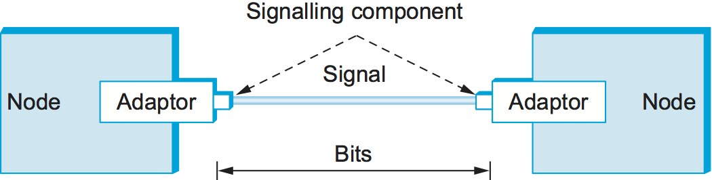
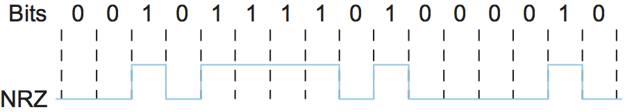

# {{Paj.Toe}}

将节点和链接转换成可用的构建块的第一步是理解如何以这样的方式连接它们,使得比特可以从一个节点传输到另一个节点. 如前一节所述,信号在物理链路上传播. 因此,任务是将源节点想要发送的二进制数据编码为链路能够携带的信号,然后在接收节点将信号解码回相应的二进制数据. 我们忽略了调制的细节,假设我们正在使用两个离散信号: 高和低. 实际上,这些信号可以对应于铜基链路上的两个不同电压或光链路上的两个不同功率电平. 

本章中讨论的大部分函数由A*网络适配器*-连接节点到链接的硬件. 网络适配器包含信令组件,该信令组件实际将比特编码为发送节点处的信号,并将信号解码为接收节点处的比特. 因此,如图所示[图1](#node-link-1)信号在两个信令组件之间的链路上传播,比特在网络适配器之间流动. 

<figure class="line">
	
	
	<figcaption>Signals travel between signalling components; bits
	flow between adaptors.</figcaption>
</figure>

让我们回到将比特编码到信号上的问题. 要做的明显的事情是把数据值1映射到高信号上,把数据值0映射到低信号上. 这正是一个编码方案所使用的映射,足够模糊,*不归零* (NRZ) . 例如,[图2](#nrz)示意性地描绘了对应于特定序列比特 (顶部) 的传输的NRZ编码信号 (底部) . 

<figure class="line">
	
	
	<figcaption>NRZ encoding of a bit stream.</figcaption>
</figure>

NRZ的问题在于,几个连续的1s的序列意味着信号在链路上保持高电平一段较长的时间;类似地,几个连续的0s意味着信号长时间保持低电平. 有一个基本问题是由1s或0的长串引起的. *基线漂移*. 具体地说,接收机保持迄今为止看到的信号的平均值,然后使用这个平均值来区分低信号和高信号. 每当信号显著低于这个平均值时,接收机就断定它刚刚看到a 0;同样,显著高于平均值的信号被解释为1. 当然,问题在于太多的连续1或0导致这个平均值改变,使得更难以检测信号中的显著变化. 

第二个问题是频繁的从高到低的转变. *反之亦然*必须启用*时钟恢复*. 直观地,时钟恢复问题是,编码和解码过程都由时钟驱动,每个时钟周期发送者发送一个比特,而接收器恢复一个比特. 发送器和接收器的时钟必须精确地同步,以便接收器恢复发送器发送的相同位. 如果接收器的时钟甚至比发送器的时钟稍快或慢,那么它就不能正确地解码信号. 你可以想象通过单独的电线将时钟发送到接收器,但是这通常被避免,因为它使布线的成本增加了一倍. 因此,接收机从时钟信号恢复过程中得到时钟. 每当信号改变时,例如在从1到0或从0到1的转换时,接收器就知道它处于时钟周期边界,并且可以重新同步自己. 然而,长时间没有这种过渡会导致时钟漂移. 因此,时钟恢复取决于信号中有大量的转换,而不管发送什么数据. 

解决这个问题的一种方法,叫做*翻转不归零制* (NRZI) ,发送器从当前信号过渡到编码1,并停留在当前信号上编码0. 这解决了连续1s的问题,但是显然对于连续的0不起作用. [图3](#encode-all). 另一种方法,叫做*曼彻斯特编码*通过发送NRZ编码数据和时钟的异或,执行将时钟与信号合并的更明确的工作.  (将本地时钟看作一个从低到高交替的内部信号;低/高对被认为是一个时钟周期. ) [图3](#encode-all)下面. 请注意,曼彻斯特编码导致0被编码为低到高转换,1被编码为高到低转换. 因为两个0和1s都导致信号的转换,所以时钟可以在接收机中有效地恢复.  (也有曼彻斯特编码的变体,称为*差分曼彻斯特码*其中,用等于前一比特信号的后半部分的信号的前半部分对信号进行编码,并且用与前一比特信号的后半部分相反的信号的前半部分对信号进行编码. 

<figure class="line">
	
	
	<figcaption>Different encoding strategies.</figcaption>
</figure>

曼彻斯特编码方案的问题是它使链路上进行信号转换的速率加倍,这意味着接收机有一半的时间来检测信号的每个脉冲. 信号变化的速率称为链路. *波特率*. 在曼彻斯特编码的情况下,比特率是波特率的一半,因此编码仅被认为是50%的有效的. 请记住,如果接收器能够跟上曼彻斯特编码所需的更快波特率. [图3](#encode-all)然后,NRZ和NRZI都能够在同一时间段传输两倍的比特. 

我们认为的最终编码,叫做*4B/5B*试图解决曼彻斯特编码效率低下的问题,而不会遇到延长高信号或低信号持续时间的问题. 4B/5B的思想是在比特流中插入额外的比特,以便分解0或1的长序列. 具体地说,每4比特的实际数据被编码成5比特代码,然后被发送到接收机;因此,名称4B/5B. e没有多于一个前导0和多于两个后导0. 因此,当背对背发送时,没有一对5位代码导致超过三个连续的0被发送. 然后,使用NRZI编码来传输最终的5位代码,这解释了为什么代码只关注连续0s-NRZI已经解决了连续1s的问题. 

|  4位数据符号 |    5位码   |
| :-----: | :------: |
|   0000  | 一万一千一百一十 |
|   0001  |   01001  |
|   0010  |   一万零一百  |
|   0011  |  一万零一百零一 |
|   0100  |   01010  |
|   0101  |   01011  |
|   0110  |   01110  |
|   0111  |   01111  |
|    一千   |   一万零一十  |
|   一千零一  |  一万零一十一  |
|  一千零一十  |  一万零一百一十 |
|  一千零一十一 | 一万零一百一十一 |
|   一千一百  |  一万一千零一十 |
|  一千一百零一 | 一万一千零一十一 |
|  一千一百一十 |  一万一千一百  |
| 一千一百一十一 | 一万一千一百零一 |

*表1. 4B/5B编码. *

[表1](#4b5b)给出对应于16个可能的4位数据符号中的每一个的5位代码. 请注意,由于5位足以编码32种不同的代码,而我们只对数据使用这些代码中的16种,因此剩下的16种代码可用于其他目的. 其中,代码`11111`当行空闲时,使用代码`00000`对应于线路何时死亡,以及`00100`被解释为"停止". 其余13个代码中有7个无效,因为它们违反了"一个前置0,两个后置0"规则,而另外6个代表各种控制符号. 正如我们将在本章后面看到的,一些框架协议利用这些控制符号. 
