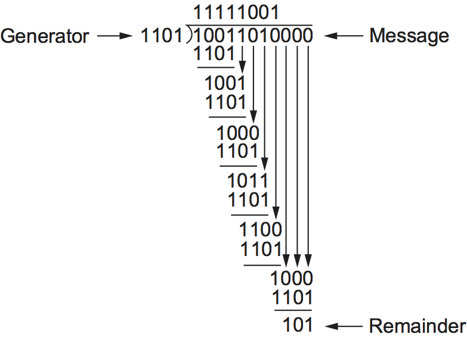

# {{Paj.Toe}}

如第1章所讨论的,有时将比特错误引入到帧中. 例如,这种情况是由于电干扰或热噪声引起的. 虽然误差很少,特别是在光链路上,但是需要一些机制来检测这些误差,以便采取纠正措施. 否则,最终用户会感到困惑,为什么刚才成功编译的C程序现在突然出现语法错误,而在此期间发生的所有事情就是它被跨网络文件系统复制. 

计算机系统中处理位错误的技术历史悠久,至少可以追溯到二十世纪四十年代. 汉明码和里德-所罗门码是两个著名的例子,它们被开发用于穿孔卡阅读器ㄡ在磁盘上存储数据以及早期的核心存储器中. 本节介绍网络中最常用的一些错误检测技术. 

检测错误只是问题的一部分. 另一部分是纠正错误一旦检测到. 当消息的接收者检测到错误时,可以采取两种基本方法. 一种是通知发送者消息被损坏,以便发送者可以重传消息的副本. 如果比特错误是罕见的,那么在完全可能的情况下,重发拷贝将是无差错的. 或者,一些类型的错误检测算法允许接收方在正确的消息被损坏之后重新构造正确的消息;这些算法依赖于*纠错码*,下面讨论. 

检测传输误差最常用的技术之一是一种称为*循环冗余校验* (CRC) . 它用于前一节中讨论的几乎所有链路级协议 (例如,HDLCㄡDDCMP) ,以及本章后面描述的CSMA和无线协议. 概述了基本的CRC算法. 在讨论该方法之前,我们考虑两个简单的方案: *二维奇偶校验*和*校验和*. 前者被BISYNC协议用于传输ASCII字符 (当BISYNC用于传输EBCDIC时,CRC用作错误检测代码,EBCDIC是60年代使用的替代字符编码方案) ,而后者被多个因特网协议使用. 

任何错误检测方案背后的基本思想是将冗余信息添加到可用于确定是否引入错误的帧中. 在极端情况下,我们可以想象传输两个完整的数据副本. 如果两个拷贝在接收器上是相同的,那么这两种拷贝都可能是正确的. 如果它们不同,则将错误引入其中一个 (或两者) ,并且必须丢弃它们. 这是一个相当差的错误检测方案有两个原因. 首先,它为$$$$BIT消息发送$$$$冗余位. 第二,许多错误将无法检测到ℴℴ任何碰巧破坏消息第一和第二副本中相同位位置的错误. 一般来说,错误检测码的目标是提供与相对少量的冗余比特结合的检测错误的高概率. 

幸运的是,我们可以比这个简单的计划做得更好. 通常,我们可以提供非常强大的错误检测能力,同时仅发送$$n$$位消息的$$k$$冗余位,其中$$k$$远小于$$n$$$. 例如,承载高达12000位(1500字节)数据的帧只需要32位CRC代码,或者如通常所表示的,使用CRC-32. 这样的代码将捕获绝大多数错误,正如我们将在下面看到的. 

我们说,我们发送的额外比特是多余的,因为它们不给消息添加新的信息. 取而代之的是,它们使用一些定义良好的算法直接从原始消息导出. 发送者和接收者都知道算法是什么. 发送方将算法应用于消息以生成冗余比特. 然后,它发送消息和那些额外的位. 当接收方对接收到的消息应用相同的算法时,它应该 (在没有错误的情况下) 得到与发送方相同的结果. 它将结果与发送者发送给它的结果进行比较. 如果它们匹配,则可以推断 (在很高的可能性) 在传输过程中没有错误引入到消息中. 如果它们不匹配,可以确保消息或冗余位被损坏,并且它必须采取适当的行动,即,如果可能的话,丢弃消息或对其进行纠正. 

关于这些额外位的术语的一个注释. 一般来说,它们被称为*检错码*. 在特定的情况下,当创建代码的算法是基于加法时,它们可以被称为*校验和*. 我们将看到Internet校验和被适当地命名: 它是一个使用求和算法的错误检查. 不幸的是,这个词*校验和*通常用不精确的方式来表示任何形式的错误检测代码,包括CRCs. 这可能会让人困惑,所以我们敦促你使用这个词. *校验和*只适用于实际使用加法和使用的代码. *检错码*参考本节中描述的通用代码类. 

## 二维宇称

二维奇偶校验正好是这个名字所暗示的. 它是基于"简单" (一维) 奇偶校验的,它通常涉及在7位代码中添加一个额外位以平衡字节中的1位数. 例如,如果需要给出字节中的奇数1s,奇奇奇偶校验将第八位设置为1,如果需要给出字节中的偶数1s,偶奇偶校验将第八位设置为1. 二维奇偶校验对帧中包含的每个字节的每个比特位置进行类似的计算. 这导致整个帧的额外奇偶校验字节,除了每个字节的奇偶校验位. [图1](#two-dparity)下面说明了二维偶数奇偶校验对于一个包含6字节数据的示例帧的工作原理. 注意,奇偶校验字节的第三位是1,因为在帧中的6个字节中,第三位中有奇数个1s. 可以看出,二维奇偶校验捕获所有1,2,和3位错误,以及大多数4位错误. 在这种情况下,我们在42位消息中添加了14位冗余信息,但是与上述"重复代码"相比,我们对常见错误具有更强的保护. 

<figure class="line">
	<a id="two-dparity"></a>
	
	<figcaption>Two-dimensional parity.</figcaption>
</figure>

## 互联网校验和算法

第二种错误检测方法是通过因特网校验和来举例说明的. 虽然它不在链接级别使用,但是它提供了与CRC和奇偶校验相同的功能,所以我们在这里讨论它. 

互联网校验和背后的思想非常简单ℴℴ您将传输的所有单词相加,然后传输该和的结果. 结果是校验和. 接收机对接收的数据执行相同的计算,并将结果与接收的校验和进行比较. 如果任何传输的数据 (包括校验和本身) 被破坏,那么结果将不匹配,因此接收器知道发生了错误. 

你可以想象一下校验和的基本思想有很多不同的变化. 互联网协议使用的精确方案如下. 将校验为16位整数序列的数据考虑在内. 使用16位补码算法 (下面解释) 将它们相加,然后取结果的补码. 16位数字是校验和. 

在补码运算中,负整数 (-x) 表示为x的补码;即,x的每个位是倒置的. 当在补码算法中加上数字时,需要从结果中加入最位数的乘积. 例如,考虑在4位整数上加上-5和-3的一个补算法: +5是0101,so-5是1010;+3是0011,so-3是1100. 如果我们加1010和1100,忽略携带,我们得到0110. 在一个补算法中,这个操作导致从最高有效位进位的事实导致我们增加结果,给出0111,这是-8的补表示 (通过在1000中反转位而获得) ,正如我们所期望的. 

下面的例程给出了互联网校验和算法的直接实现. 这个`count`参数给出长度`buf`以16位单位测量. 例程假定`buf`已经填充了0到16位边界. 

```c
u_short 
cksum(u_short *buf, int count) 
{
    register u_long sum = 0;

    while (count--) 
    {
        sum += *buf++;
        if (sum & 0xFFFF0000) 
        {
            /* carry occurred, so wrap around */
            sum &= 0xFFFF;
            sum++;
        }
    }
    return (sum & 0xFFFF);
}
```

此代码确保计算使用一个补算法,而不是大多数机器中使用的两个补. 注意`if`语句内部`while`循环. 如果有一个进位进入前16位`sum`然后我们增加`sum`就像前面的例子一样. 

与我们的重复代码相比,这个算法对于使用少量冗余比特 (对于任何长度的消息只有16个冗余比特) 的评分很好,但是对于错误检测的强度来说,它不能得到非常好的评分. 例如,一对单位错误将无法检测到,其中之一将一个单词递增,另一个单词递减相同的量. 使用这种算法的原因很简单: 这种算法在软件中更容易实现. 在ARPAET中的经验表明,这种形式的校验和是足够的. 其充分的一个原因是,该校验和是端到端协议中的最后一道防线;大多数错误是由链路级别上更强大的错误检测算法 (如CRC) 拾取的. 

## 循环冗余校验

现在应该清楚了,设计错误检测算法的主要目标是最大化仅使用少量冗余位检测错误的概率. 循环冗余校验使用一些相当强大的数学来实现这一目标. 例如,32位CRC对数千字节长的消息中常见的位错误提供了强有力的保护. 循环冗余校验的理论基础植根于一个数学分支. *有限域*. 虽然这听起来可能令人畏惧,但基本思想可以很容易理解. 

首先,将(n+1)位消息看作由$$n$$度多项式表示的,即,最高阶项为$$x^{n}$$的多项式. 消息由多项式表示,方法是使用消息中每个比特的值作为多项式中每个项的系数,从表示最高阶项的最高有效位开始. 例如,由比特10011010组成的8位消息对应于多项式. 

$M(x)=(1乘以x^7)+(0乘以x^6)+(0乘以x^5)+(1乘以x^4)+(1乘以x^3)+(0乘以x^2)+(1乘以x^1)+(0乘以x^0)$(0

$M (x) =x^ 7 +x^ 4 +x^ 3 +x^ 1 $ $

因此,我们可以想到发送者和接收者作为交换彼此的多项式. 

为了计算CRC,发送方和接收方必须同意*除数*多项式,$C (x) $$. $C (x) $$是一个多项式的程度$K $ $. 例如,假设$C (x) =x^ 3 +x^ 2+1 $ $. 在这种情况下,$K=3美元$. 这个问题的答案是: "$C (x) $$从何而来?"实际上,$ C(x)$的选择对哪些类型的错误可以被可靠地检测有很大的影响,正如我们在下面讨论的. 对于各种环境,有一些除数多项式是非常好的选择,通常作为协议设计的一部分进行精确的选择. 例如,以太网标准使用著名的多项式32. 

当发送方希望发送n+1比特长的消息$M(x)$时,实际发送的是n+1比特消息加上$k$比特. 我们调用完整的传输消息,包括冗余位,$p (x) $ $. 我们要做的是设法使表示$P(x)$的多项式精确可被$C(x)$$整除;我们解释一下这是如何实现的. 如果$P(x)$是通过链路传输的,并且在传输过程中没有引入错误,那么接收方应该能够将$P(x)$除以$C(x)$,剩下的为零. 另一方面,如果在传输期间将一些错误引入$P(x)$中,那么在所有的可能性中,接收的多项式将不再完全可被$C(x)$$整除,因此接收器将获得非零余数,暗示错误已经发生. 

如果你对多项式算术略知一二,就会有助于理解下面的内容;它与普通的整数算术略有不同. 这里我们处理的是一类特殊的多项式算法,其中系数可能只有一个或零,对系数的运算是使用模2算法进行的. 这被称为"多项式算术模2". 由于这是一本网络书籍,而不是数学文本,为了我们的目的,让我们关注这类算术的关键特性 (我们诚恳地要求你们接受) : 

-   任何多项式$ B (x) $ $可以除以一个除数多项式$ C (x) $ $如果$B (x) $ $是更高的程度比$C (x) $ $. 

-   任何多项式$ B (x) $ $可以被除以一次除数多项式$ C (x) $ $如果$ B (x) $ $是相同的程度为$ C (x) $ $. 

-   $B(x)$$除以$C(x)$$时获得的余数是通过对每对匹配系数执行异或(XOR)操作获得的. 

例如,多项式$$x^3+1$$可以除以$$x^3+x^2+1$$ (因为它们都是3度数) ,其余为$$0乘以x^3+1乘以x^2+0乘以x^1+0乘以x^0=x^2$ (通过XORing每个项的系数得到) . 在消息方面,我们可以说1001可以除以1101,剩下0100. 您应该能够看到其余的只是两个消息的位异或. 

现在我们已经知道了划分多项式的基本规则,就可以进行长除法了,这是处理较长消息所必需的. 下面是一个例子. 

回想一下,我们想为传输创建一个多项式,该多项式源自原始消息$$M(x)$$,比$$M(x)$$长$$k$$,并且可以被$$C(x)$$精确地整除. 我们可以这样做: 

1.  乘$M (x) $$ $x^ {k}$$;也就是说,在消息的末尾添加$$$$零点. 调用这个零扩展消息$T (x) $ $. 

2.  将$T (x) $$ $$ (x) $$,并找到余数. 

3.  从$T (x) $$中减去余数. 

显然,在这一点上剩下的是一个完全可以被$C (x) $ $整除的消息. 我们还可以注意到,结果消息由$M(x)$组成,后面跟着步骤2中获得的余数,因为当我们减去余数 (长度不超过$k$$位) 时,我们只是使用步骤1中添加的$$k$$0对它进行XORing. 这一部分将通过一个例子变得更加清晰. 

考虑消息$x^ 7 +x^ 4 +x^ 3 +x^ 1 $ $,或10011010. 我们首先乘以$x^ 3 $ $,因为我们的除数多项式是度为3. 这给出了10011010000. 我们把这个$ $ (x) $ $,这相当于在这种情况下1101美元. [图2](#crcalc)显示多项式长除法运算. 根据上面描述的多项式运算规则,长除法运算的进展情况与整数除法相同. 因此,在我们的示例的第一步中,我们看到,除数1101将一次划分为消息(1001)的前四位,因为它们具有相同的程度,并且留下100的剩余部分(1101 XOR 1001). 下一步是从消息多项式中取下一位数,直到我们得到与$$C(x)$$同度的另一个多项式,在本例中是1001. 我们再次计算余数 (100) ,并继续计算直到完成. 请注意,长除法的"结果",出现在计算的顶部,实际上并不引起太大的兴趣,重要的是最后剩下的部分. 

你可以从最下面看到[图2](#crcalc)示例计算的其余部分是101. 所以我们知道10011010000减101完全可以被$C (x) $整除,这就是我们发送的. 多项式运算中的负运算是逻辑异或运算,所以我们实际发送10011010101. 如上所述,这原来只是原始消息,并且附加了长除法计算的剩余部分. 收件人将接收的多项式除以$$ (x) $ $,如果结果是0,则得出结论没有错误. 如果结果为非零,则可能需要丢弃已损坏的消息;对于某些代码,可能是*对的*一个小错误 (例如,如果错误只影响一个比特) . 允许纠错的代码称为*纠错码* (ECC) . 

<figure class="line">
	<a id="crcalc"></a>
	
	<figcaption>CRC calculation using polynomial long division.</figcaption>
</figure>

现在我们将考虑多项式$$x (x) $来自何处的问题. 直觉上,这个想法是选择这个多项式,这样它就不太可能均匀地分割成一个引入错误的消息. 如果所传输的消息是$$P(x)$$,我们可能认为引入错误是添加另一个多项式$$E(x)$$,所以接收方看到$$P(x)+E(x)$$. 如果接收到的消息可以平均除$C(x)$$,并且我们知道$P(x)$$可以平均除$C(x)$$,则只有当$E(x)$$可以平均除$C(x)$$,才会发生错误. 诀窍是选择$$ (x) $$,这样对于常见类型的错误来说是不太可能的. 

一种常见的错误类型是一个单位错误,它可以表示为$$ (x) =x^ i $ $,当它影响位位置$$i $. 如果我们选择$C(x)$$,使得第一项和最后一项 (即$$x^k$$和$$x^0$$.) 为非零,那么我们已经有一个两项多项式,它不能均匀地分割为一项$$E(x)$.因此,$$ (x) $$可以检测所有的单位错误. 一般来说,可以证明以下类型的错误可以用$$ (x) $ $与所述属性进行检测: 

-   所有的单比特错误,只要$x^ {k}$ $和$x^ { 0 } $$都具有非零值系数. 

-   所有的双位错误,只要$C (x) $ $的因数至少有三个项

-   任何奇数的错误,只要$C (x) $ $包含$$ (x+1) $ $

我们已经提到,使用代码不仅可以检测错误的存在,而且可以纠正错误. 由于这些代码的细节需要比理解CRC所需的更复杂的数学,因此这里不再赘述. 然而,值得考虑的是校正与检测的优点. 

乍一看,似乎更正总是更好的,因为通过检测,我们不得不丢弃消息,并且通常要求发送另一个副本. 这使用了带宽,并且可能在等待重传时引入等待时间. 然而,校正也有缺点,因为通常需要更多的冗余位来发送与仅检测错误的代码一样强 (即,能够处理相同范围的错误) 的错误校正代码. 因此,虽然错误检测需要在错误发生时发送更多的比特,但是纠错需要发送更多的比特. *总是*. 结果,当(1)错误非常可能时,纠错往往最有用,例如,在无线环境中,或者(2)重传的成本太高,例如,由于涉及通过卫星链路重传分组的延迟. 

纠错码在网络中的使用有时被称为"纠错码". *前向纠错* (FEC) 因为错误纠正是通过"提前"发送额外信息来处理的,而不是等待错误发生并且稍后通过重传来处理. FEC通常在诸如802.11的无线网络中使用. 

-   任何"突发"错误 (即,连续错误位序列) ,其突发长度小于$k$位 (大多数长度大于$k$位的突发错误也可以被检测) . 

六个版本的$$ (x) $$被广泛地用于链路级协议. 例如,以太网使用CRC-32,其定义如下: 

-   CRC-32=$x^ {x}{ 26 } +x^ { 23 } +x^ { 22 } +x^ { 16 } +x^ { 12 } +x^ { 11 } +x^ {10 } +x^ 8 +x^ 7 +x^ 5 +x^ 4 +x^ unsix+x+$ $ $

最后,我们注意到,CRC算法虽然看起来很复杂,但是很容易在硬件中使用$$k$$$位移位寄存器和XOR门来实现. 移位寄存器中的比特数等于生成多项式的程度 ($K $ $) . [图3](#crc-hard)显示的硬件将用于发电机$ X^ 3 +X^ 2 + 1美元$从我们的前一个例子. 与长除法示例中一样,消息从左移入,从最高有效位开始,并以附加到消息的$k$$zeros字符串结尾. 当所有位都移位并适当地XOR化后,寄存器包含剩余部分,即CRC (右边最有意义的位) . 异或门的位置确定如下: 如果移位寄存器中的位被标记为0到$k-1$$,从左到右,那么如果在生成器多项式中有一个术语$x^n$,则将一个异或门放在位$n$的前面. 因此,我们看到一个XOR门前面的位置0和2的发电机$x^ 3 +x^ 2 +x^ 0美元$. 

<figure class="line">
	<a id="crc-hard"></a>
	
	<figcaption>CRC calculation using shift register.</figcaption>
</figure>
