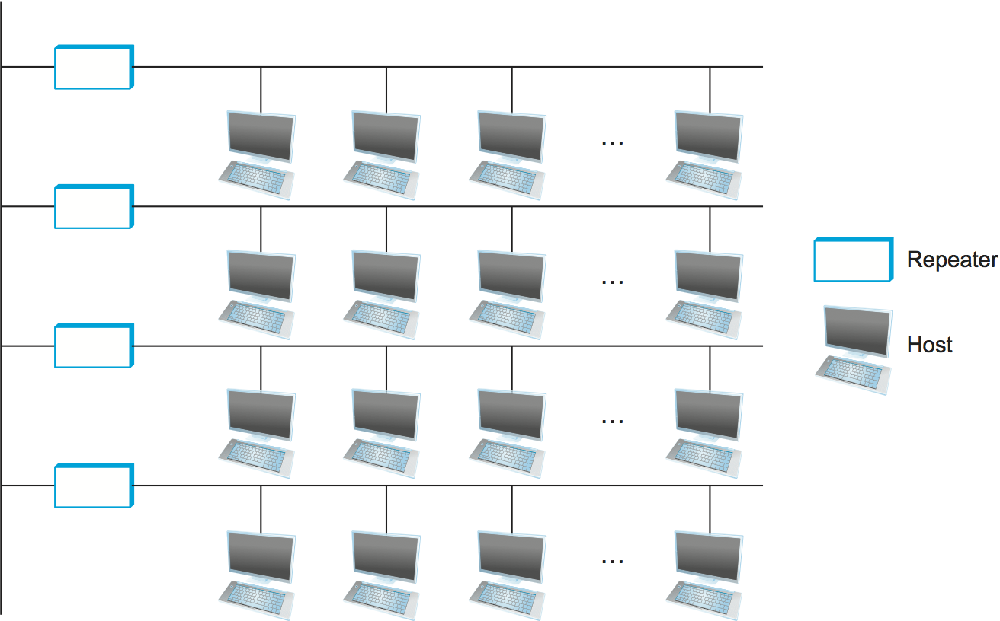
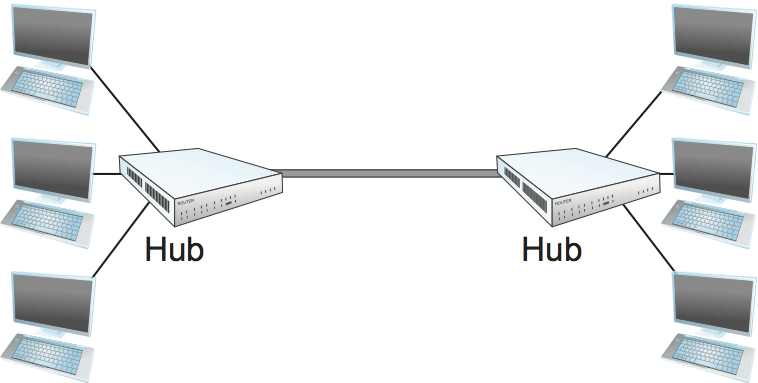
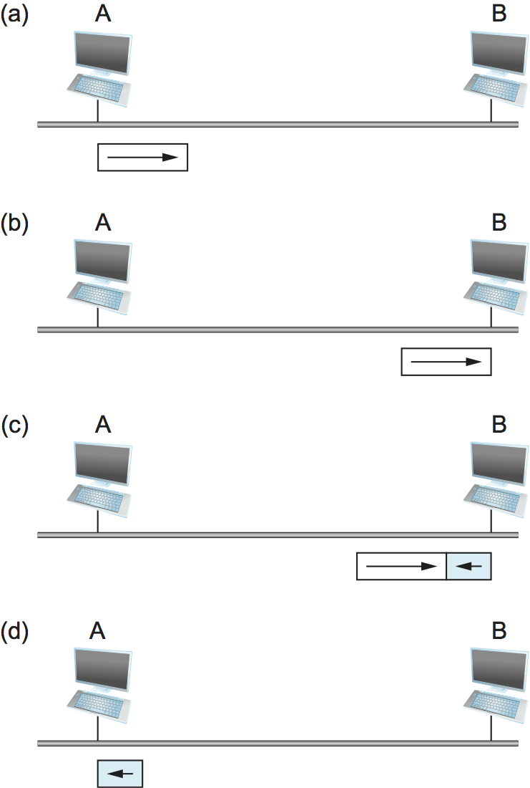

# {{Paj.Toe}}

20世纪70年代中期,由施乐帕洛阿尔托研究中心 (PARC) 的研究人员开发的以太网,最终从一系列竞争性技术中脱颖而出,成为局域网的主导技术. 如今,它主要与802.11个无线网络竞争,但在校园网络和数据中心仍然非常流行. 以太网背后的技术更通用的名称是载波侦听ㄡ具有碰撞检测的多址 (CSMA/CD) . 

如CSMA名称所示,以太网是多址网络,这意味着一组节点通过共享链路发送和接收帧. 因此,你可以认为以太网就像一个总线,它插入了多个站点. CSMA/CD中的"载波感知"意味着所有节点可以区分空闲链路和忙碌链路,而"冲突检测"意味着节点在发送时监听,因此可以检测它正在发送的帧何时与另一节点发送的帧干扰(冲突). 

以太网起源于早期的分组无线电网络,称为Aloha,由夏威夷大学开发,以支持夏威夷群岛上的计算机通信. 与Aloha网络一样,以太网面临的基本问题是如何公平有效地调解对共享介质的访问 (在Aloha中,介质是大气,而在以太网中,介质是同轴电缆) . ALOHA和以太网的核心思想是一种控制每个节点可以传输的算法. 

有趣的是,现代以太网链路现在基本上是点对点;也就是说,它们将一台主机连接到一个以太网. *转换*,或者它们相互连接开关. 因此,在当今的以太网络中,"多址"技术没有被广泛使用. 同时,无线网络已经变得非常流行,所以从Aloha开始的多址技术今天再次主要用于无线网络,例如802.11(Wi-Fi)网络. 这些网络将在后面的章节中讨论. 

我们将在下一章讨论以太网交换机. 现在,我们将关注单个以太网链路的工作原理. 尽管多址以太网正在成为历史的一个奇迹,但是多址网络的原理仍然非常重要,值得我们进一步讨论,我们将在下面提供. 

数字设备公司和英特尔公司于1978加入施乐公司,定义了一个10 Mbps以太网标准. 然后,这个标准形成了IEEE标准802.3的基础,IEEE标准802.3还定义了以太网可以操作的更广泛的物理介质集合,包括100-Mbpsㄡ1-Gbps和10-Gbps版本. 

## 物理性质

以太网段最初使用长度可达500米的同轴电缆实现(现代以太网使用双绞铜对,通常称为"5类"或光纤,在某些情况下可远长于500米). 有线电视. 主机通过接入以太网连接段. 一*收发器*一种直接连接到水龙头的小型设备,当线路空闲时检测,当主机正在发送时驱动信号. 它也接收进来的信号. 收发器又连接到一个插入到主机中的以太网适配器. 此配置显示在[图1](#tap).

<figure class="line">
	<a id="tap"></a>
	
	<figcaption>Ethernet transceiver and adaptor.</figcaption>
</figure>

多个以太网段可以连接在一起*中继器*. 中继器是一种转发数字信号的装置,就像放大器转发模拟信号一样. 中继器只理解比特,而不理解帧;然而,在任何一对主机之间最多只能定位四个中继器,这意味着经典以太网的总覆盖范围只有2500米. E中的一个[图2](#net-repeat)也就是说,每个楼层都有一个分段的建筑. 

<figure class="line">
	<a id="net-repeat"></a>
	
	<figcaption>Ethernet repeater.</figcaption>
</figure>

也可以创建多路中继器,有时称为*枢纽*,如图所示[图3](#hub). 集线器只是重复它在一个端口上听到的所有其他端口. 

主机放在以太网上的任何信号都通过整个网络进行广播;也就是说,信号在两个方向上传播,并且中继器和集线器将信号转发到所有输出段. 连接在每个分段末端的端子吸收信号,防止信号反弹并干扰尾随信号. 最初的以太网规范使用前面部分描述的曼彻斯特编码方案,而4B/5B编码或类似的8B/10B方案今天在高速以太网上使用. 

<figure class="line">
	<a id="hub"></a>
	
	<figcaption>Ethernet hub.</figcaption>
</figure>

重要的是要理解,给定的以太网是否跨越单个段ㄡ由中继器连接的段的线性序列或由集线器以星形配置连接的多个段,由该以太网上的任何一台主机发送的数据到达所有其他主机. 这是个好消息. 坏消息是,所有这些主机都在争夺对同一链接的访问,因此,据说它们处于相同的链接中. *碰撞域*. 以太网的多址部分是关于处理在冲突域中出现的链路的竞争. 

## 访问协议

现在我们将注意力转向控制对共享以太网链路的访问的算法. 这种算法通常称为以太网. *媒体访问控制* (MAC) . 它通常在网络适配器上的硬件中实现. 我们不会描述硬件*本身*,而是专注于它实现的算法. 然而,首先,我们描述以太网的帧格式和地址. 

### 帧格式

每个以太帧是由给定的格式定义的[图4](#enet-format). 64位前导允许接收机与信号同步,它是一个交替的0和1序列. 源和目标主机都用48位地址标识. 包类型字段充当解复用密钥;它标识这个帧应该被传递到许多更高级别的协议中的哪一个. 每个帧包含多达1500个字节的数据. 最低限度,一帧必须包含至少46字节的数据,即使这意味着主机在发送帧之前必须填充该帧. 这个最小帧大小的原因是帧必须足够长才能检测到碰撞,下面我们将对此进行更多的讨论. 最后,每个帧包括32位CRC. 与前面描述的HDLC协议一样,以太网是一种面向比特的帧协议. 注意,从主机的角度来看,以太网帧具有14字节的报头: 两个6字节地址和2字节类型字段. 发送适配器在发送前附加前导码和CRC,接收适配器移除它们. 

<figure class="line">
	<a id="enet-format"></a>
	
	<figcaption>Ethernet frame format.</figcaption>
</figure>

### 地址

事实上,世界上的每个以太网主机都有一个独特的以太网地址. 从技术上讲,地址属于适配器,而不是主机;它通常被烧录到ROM中. 以太网地址通常以一种人类能够读出的形式打印,由冒号分隔的六个数字的序列. 每个数字对应于6字节地址的1个字节,由一对十六进制数字给出,每对十六进制数字对应一个字节中的4位字节;前导0被丢弃. 例如,`8:0:2b:e4:b1:2`是人类可读的以太网地址表示

```pseudo
00001000  00000000  00101011  11100100  10110001  00000010
```

为了确保每个适配器获得一个唯一的地址,以太网设备的每个制造商被分配一个不同的前缀,该前缀必须被加在它们构建的每个适配器上的地址上. 例如,高级微设备已经被分配了24位前缀. `080020` (或) `8:0:20`) 一个给定的制造商然后确保它产生的地址后缀是唯一的. 

在以太网上传输的每个帧都由连接到该以太网的每个适配器接收. 每个适配器识别那些寻址到其地址的帧,并且只将这些帧传递给主机.  (适配器也可以被编程为运行在*混杂的*模式,在这种情况下,它将所有接收到的帧发送到主机,但这不是正常模式. *单播*地址,由所有1s组成的以太网地址被视为一个*广播*地址;所有适配器通过寻址到主机的广播地址的帧. 类似地,将第一位设置为1但不是广播地址的地址称为*组播*地址. 给定主机可以对适配器进行编程以接受多组多播地址. 多播地址用于将消息发送到以太网 (例如,所有文件服务器) 上的主机的一些子集. 总之,以太网适配器接收所有帧并接受. 

-   指向自身地址的帧

-   发送到广播地址的帧

-   如果已指示侦听该地址,则将帧发送给多播地址. 

-   所有帧,如果它被放置在混杂模式下

它只传递给主机它接受的帧. 

### 发送器算法

正如我们刚刚看到的,以太网协议的接收方是简单的,真正的智能是在发送方方实现的. 发射机算法定义如下. 

当适配器有要发送的帧并且线路空闲时,它立即发送该帧;没有与其他适配器的协商. 消息中的1500个字节的上界意味着适配器只能占用一段固定的时间. 

当适配器有一个要发送的帧,并且线路忙时,它等待线路空闲,然后立即发送.  (更确切地说,在开始传输下一帧后,所有适配器在一帧结束后等待9.6 $ $MU $ S. 这对于第一帧的发送者以及监听线路成为空闲的那些节点来说都是正确的. *1-坚持*协议,因为每当忙线空闲时,具有帧发送的适配器以概率1发送. 一般来说,A*p-持续*算法在一条线路变为空闲之后以概率$$ 0 LE LE 1 $ $发送,并以概率$q=1 -p$ $推迟. 选择一个$$p\<1$$背后的理由是,可能有多个适配器等待繁忙线路变为空闲,并且我们不希望所有的适配器同时开始传输. 如果每个适配器以例如33%的概率立即发送,那么最多三个适配器可以等待发送,并且当线路空闲时只有一个适配器将开始发送. 尽管有这种推理,以太网适配器总是在注意到网络已变得空闲之后立即进行传输,并且在这样做时非常有效. 

要完成关于$$p$$-persistent协议的故事,例如$$p\<1$$,您可能想知道丢失硬币翻转的发送者 (即,决定推迟) 必须等待多长时间才能发送. Aloha网络最初开发了这种类型的协议,它的答案是将时间划分为离散的时隙,每个时隙对应于传输一整帧所需的时间长度. 每当节点有要发送的帧并且它检测到一个空的 (空闲) 时隙时,它以概率$$p$$进行发送,并推迟到概率$$q=1-p$$的下一个时隙. 如果下一个时隙也是空的,则节点再次决定发送或推迟,概率分别为$$$$和$$$$. 如果下一个时隙不是空的-也就是说,其他一些站已经决定发送-那么节点仅仅等待下一个空闲时隙并且算法重复. 

回到我们对以太网的讨论,因为没有集中控制,所以两个 (或多个) 适配器可以同时开始传输,或者因为两个适配器都发现线路空闲,或者因为两个适配器都等待繁忙的线路变为空闲. 当发生这种情况时,两个 (或更多) 帧被称为*碰撞*在网络上. 每个发送方,因为以太网支持碰撞检测,能够确定碰撞正在进行中. 当适配器检测到其帧与另一帧发生冲突时,它首先确保发送32位干扰序列,然后停止传输. 因此,在冲突的情况下,发射机将最低发送96个位: 64位前导加32位干扰序列. 

一种适配器只发送96位的方法,有时称为*短小框架*-如果这两个主机彼此接近. 如果两台主机相距更远,那么在检测到冲突之前,它们必须传输更长的时间,从而发送更多的比特. 事实上,最坏的情况发生在两个主机在以太网的相反端. 为了确定它刚刚发送的帧没有与另一帧冲突,发射机可能需要发送多达512比特. 并非巧合,每个以太网帧必须至少有512位(64字节)长: 14字节的头部加上46字节的数据加上4字节的CRC. 

为什么512位?答案与你可能会问的关于以太网的另一个问题有关: 为什么它的长度仅限于2500μm?为什么不是10或1000公里?这两个问题的答案都与这样一个事实有关,即两个节点相距越远,一个节点发送的帧到达另一个节点所需的时间就越长,并且网络在这段时间内容易发生冲突. 

<figure class="line">
	<a id="worst"></a>
	
	<figcaption>Worst-case scenario: (a) A sends a frame at time t;
	(b) A's frame arrives at B at time t+d; (c) B begins transmitting
	at time t+d and collides with A's frame; (d) B's runt (32-bit)
	frame arrives at A at time t+2d.</figcaption>
</figure>

[图5](#worst)说明最坏的情况,其中主机A和B在网络的相对端. 假设主机A在时间t开始传输帧,如 (a) 所示. 帧到达主机B需要一条链路延迟(我们用d表示延迟). 因此,A的帧的第一位在时间t+d到达B,如(b)所示. 假设在主机A的帧到达之前 (即B仍然看到空闲行) ,主机B开始发送它自己的帧. B的帧将立即与A的帧碰撞,并且这个碰撞将被主机B (C) 检测到. 主机B将发送32位干扰序列,如上所述. (B的帧将是一个缩影. )不幸的是,主机A直到B的帧到达时才知道发生了冲突,该冲突将在一个链路延迟之后发生,在时间t+2$乘以$d,如(d)所示. 主机A必须继续传输直到这时才能检测到碰撞. 换句话说,主机A必须传输2美元$$$D,以确保它检测到所有可能的冲突. 考虑到最大配置的以太网是2.5亿长,并且任何两台主机之间可能最多有4个中继器,因此确定往返延迟为51.2$mu$s,在10-Mbps以太网上对应于512位. 看待这种情况的另一种方式是,我们需要将以太网的最大延迟限制到相当小的值 (例如,51.2$mu$$s) ,以便接入算法工作;因此,以太网的最大长度必须是2.5亿左右. 

一旦适配器检测到一个冲突并停止其传输,它等待一定的时间并再次尝试. 每次尝试传输但失败时,适配器在尝试之前加倍它等待的时间量. 将每个重传尝试之间的延迟间隔加倍的策略是一种被称为*指数退避*. 更确切地说,适配器首先延迟随机选择的0或51.2×$$MU $ $. 如果这个努力失败,那么它在再次尝试之前等待0ㄡ51.2ㄡ102.4或153.6$mu$$s (随机选择) ;对于k=0..3,这是k$乘以$51.2. 在第三次碰撞之后,它等待k=$$ 51.2美元,K=0.2美元$^ 3美元$-1,再次随机选择. 通常,算法随机地选择介于0和2$^n$$-1之间的$$k$$,并等待k$乘以$$51.2$mu$$s,其中$$n$是迄今为止所经历的冲突的数量. 适配器在给定次数的尝试之后放弃,并向主机报告发送错误. 适配器通常重试到16次,尽管退避算法在上面的公式中上限为$$ $ $ 10. 

## 以太网经验

因为以太网络已经存在了很多年,并且非常受欢迎,所以我们有很多使用它们的经验. 人们对多址以太网的最重要观察之一是它们在轻负载条件下工作得最好. 这是因为在重负载下 (通常认为以太网上的利用率超过30%) 太多的网络容量被冲突浪费. 

为了减轻这些担忧,多址以太网通常以比标准允许的更保守的方式使用. 例如,大多数以太网络连接到它们的主机少于200个,远远小于1024的最大主机. 类似地,大多数以太网远短于2.5亿,往返延迟将近5美元/亩$s而不是51.2美元/亩$s. 

最后,值得一提的是,为什么以太网如此成功,以便我们能够理解我们应该用任何试图取代它的LAN技术模仿的特性. 首先,以太网非常容易管理和维护: 原始以太网中没有交换机,没有路由表或配置表需要更新,并且很容易向网络添加新主机. 很难想象一个更简单的网络来管理. 第二,它是便宜的: 电缆是便宜的,并且唯一的其他成本是在每个主机上的网络适配器. 由于这些原因,以太网变得根深蒂固,任何希望取代以太网的基于交换机的方法都需要在基础设施 (交换机) 上进行额外的投资,而不仅仅是每个适配器的成本. 正如我们将在下一章中看到的,基于交换机的技术最终成功地取代了多址以太网: 交换式以太网. 保持简单的管理 (和熟悉) 是成功的关键原因. 
