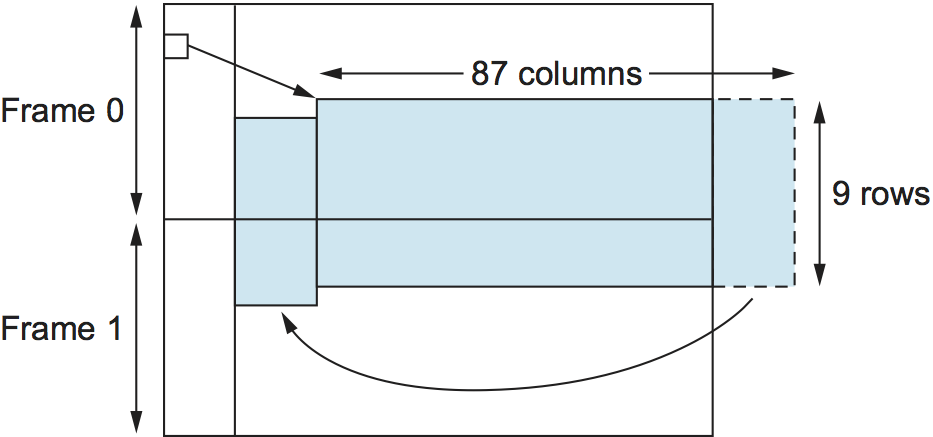

# {{Paj.Toe}}

现在我们已经了解了如何通过点对点链路 (从适配器到适配器) 传输比特序列,下面让我们考虑[图1](#host-link). 从第1章回忆起,我们关注的是分组交换网络,这意味着数据块 (称为数据块) . *框架*在这个级别上,不是比特流,在节点之间交换. 它是使节点能够交换帧的网络适配器. 当节点A希望向节点B发送帧时,它告诉适配器从节点的存储器发送帧. 这导致在链路上发送的比特序列. 然后,节点B上的适配器收集到达链路的比特序列,并将相应的帧存储在B的存储器中. 确切地识别哪组位构成帧ℴℴ也就是说,确定帧开始和结束的位置ℴℴ是适配器面临的中心挑战. 

<figure>
	
	
	<figcaption>Bits flow between adaptors, frames between hosts.</figcaption>
</figure>

解决框架问题有几种方法. 本节使用几种不同的协议来说明设计空间中的各个点. 注意,虽然我们在点对点链接上下文中讨论构架,但是这个问题是一个基本问题,在像以太网和令牌环这样的多址网络中也必须解决这个问题. 

## 面向字节的协议 (BISYNC,PPP,DDCMP) 

建立框架的最古老的方法之一ℴℴ其根源在于将终端连接到大型机ℴℴ是将每个框架视为字节 (字符) 的集合,而不是位的集合. 这样的*面向字节的*例如,IBM在20世纪60年代末开发的二进制同步通信 (BISYNC) 协议,以及数字设备公司的DECNET中使用的数字数据通信消息协议 (DDCMP) . 最近和广泛使用的点对点协议 (PPP) 提供了这种方法的另一个例子. 

### 基于哨兵的方法

[图2](#bisync)说明了BISYNC协议的帧格式. 这幅图是您将在本书中看到的用于说明帧或包格式的许多图中的第一幅,因此有几个解释的词是合适的. 我们显示一个包作为标记字段的序列. 每个字段上方是一个数字,表示该字段的位长. 注意,数据包是从最左边的字段开始传输的. 

<figure class="line">
	
	
	<figcaption>BISYNC frame format.</figcaption>
</figure>

BISYNC使用特殊字符称为*前哨角色*指示帧开始和结束的位置. 通过发送一个特殊的SYN (同步) 字符来表示一个帧的开头. 然后,帧的数据部分包含在两个更特殊的字符之间: STX (文本开始) 和ETX (文本结束) . SOH (Sead的开始) 字段与STX字段的用途大致相同. 当然,哨兵方法的问题在于,ETX字符可能出现在帧的数据部分. BISYNC克服了这个问题,它通过在一个帧中出现一个DLE (Data Link Sund) 字符来"逃离"Etx字符;DLE字符在帧体中也被转义 (通过它前面有一个额外的DLE) .  (C程序员可能注意到,这类似于当在字符串内发生反斜杠时引用标记的方式) . *字符填充*因为额外的字符被插入到帧的数据部分中. 

帧格式还包括被标记为CRC (循环冗余校验) 的字段,该字段用于检测传输错误;在稍后的部分中给出用于错误检测的各种算法. 最后,该框架包含额外的报头字段,用于除其他事项外,链路级可靠传递算法. 这些算法的例子在后面的章节中给出. 

最近的点对点协议(PPP)通常用于在各种点对点链路上承载因特网协议分组,它与BISYNC类似,因为它也使用哨兵和字符填充. 给出了PPP帧的格式. [图3](#ppp). 文本字符的特殊启动,表示为`Flag`字段是`01111110`. 这个`Address`和`Control`字段通常包含默认值,因此无趣.  (Protocol) 字段用于解复用;它标识高级协议,如IP或IPX (Novell开发的类似IP的协议) . 框架有效载荷大小可以协商,但默认为1500字节. 这个`Checksum`字段为2 (默认值) 或4字节长. 

<figure class="line">
	
	
	<figcaption>PPP frame format.</figcaption>
</figure>

PPP帧格式是不寻常的,因为几个字段大小是协商而不是固定的. 这个协商是由一个称为链路控制协议 (LCP) 的协议进行的. PPP和LCP串联工作: LCP发送封装在PPP帧中的控制消息,这样的消息由PPP (协议) 字段中的LCP标识符表示,然后转向并根据包含在这些控制消息中的信息改变PPP的帧格式. LCP还涉及在两个对等体之间建立链路时,双方检测到链路上的通信是可能的 (例如,当每个光接收器检测到从其连接的光纤的输入信号) . 

### 字节计数法

正如每一个计算机科学101的学生所知道的,用哨兵值检测文件末尾的替代方法是在文件的开头包括文件中的项目数. 框架中包含的字节数也可以作为帧头中的字段来包含. DECNET的DDCMP使用这种方法,如[图4](#ddcmp). 在这个例子中,`COUNT`字段指定帧体中包含多少字节. 

<figure class="line">
	
	
	<figcaption>DDCMP frame format.</figcaption>
</figure>

这种方法的一个危险是传输错误可能损坏计数字段,在这种情况下,帧的末端将无法被正确检测.  (如果ETX字段损坏,基于哨兵的方法也存在类似的问题. ) `COUNT`字段指示然后使用错误检测字段来确定帧是坏的. 这有时被称为*成帧误差*. 然后接收器将等待,直到它看到下一个SYN字符开始收集构成下一帧的字节. 因此,帧错误可能会导致背对背帧被错误地接收. 

## 面向比特的协议 (HDLC) 

与这些面向字节的协议不同,面向比特的协议不涉及字节边界,它只是将帧看作一组比特. 这些位可能来自某些字符集,例如ASCII;它们可能是图像中的像素值;或者它们可能是来自可执行文件的指令和操作数. IBM开发的同步数据链路控制 (SDLC) 协议是一个面向位的协议的例子;SDLC后来被ISO标准化为高级数据链路控制 (HDLC) 协议. 在下面的讨论中,我们以HDLC为例,给出了它的帧格式. [图5](#hdlc).

HDLC表示帧的开始和结束,具有区分的位序列. `01111110`. 该序列在链路空闲的任何时间也被发送,以便发送方和接收方能够保持它们的时钟同步. 以这种方式,这两种协议基本上使用哨兵方法. 因为这个序列可能出现在框架的任何地方,事实上,比特`01111110`可能交叉字节边界位协议使用DLE字符的模拟,一种称为*位填充*.

<figure class="line">
	
	
	<figcaption>HDLC frame format.</figcaption>
</figure>

HDLC协议中的位填充工作如下. 在发送端,从消息正文发送了连续五个1s的任何时间(即,不包括发送方试图发送已识别的信息时). `01111110`序列) 在发送下一位之前,发送器插入0. 在接收端,如果连续五个1到达,则接收器基于它看到的下一个比特 (即,跟随五个1之后的比特) 作出决定. 如果下一个比特是0,则它必须被填充,因此接收器将其移除. 如果下一位是1,那么有两件事情之一是正确的: 要么这是帧结束标记,要么是位流中引入了错误. 通过看*下一个*比特,接收器可以区分这两种情况. 如果它看到一个0 (即它所看到的最后8个比特) `01111110`然后,它是帧标记的末尾;如果它看到了1 (即它所看到的最后8位) . `01111111`然后,必须有一个错误,整个帧被丢弃. 在后一种情况下,接收器必须等待下一个. `01111110`在它能够再次开始接收之前,并且作为结果,存在接收机将无法接收两个连续帧的可能性. 显然,仍有一些方法可以不检测帧错误,例如当错误生成整个虚假的帧结束模式时,但是这些故障相对来说不太可能发生. 在稍后的部分中讨论了检测错误的鲁棒方法. 

位填充以及字符填充的一个有趣特性是帧的大小取决于帧的有效负载中发送的数据. 事实上,考虑到任何帧中可能携带的数据是任意的,不可能使所有帧都完全相同大小.  (为了让您相信这一点,考虑一下如果帧主体的最后一个字节是ETX字符会发生什么. ) 下一小节将描述一种确保所有帧大小相同的帧形式. 

## 基于时钟的帧结构 (SONET) 

帧同步的第三种方法以同步光网络 (SONET) 标准为例. 由于缺乏一个被广泛接受的泛项,我们简单地将这种方法称为*基于时钟的帧结构*. SONET最初由贝尔通信研究所 (Bellcore) 提出,然后由美国国家标准协会 (ANSI) 开发用于光纤数字传输,此后被ITU-T采用. 光网络上的数据传输. 

在进一步讨论SONET之前,需要说明的重要一点是,完整的规范远远大于本书. 因此,下面的讨论将只涵盖标准的高点. SONET还解决了帧问题和编码问题. 它还解决了一个对电话公司来说非常重要的问题ℴℴ将几个低速链路复用到一个高速链路上.  (事实上,SONET的大部分设计反映了这样一个事实,即电话公司必须关注传统上用于电话呼叫的64kbps信道的多路复用. ) 

与前面讨论的成帧方案一样,SONET帧具有一些特殊的信息,这些信息告诉接收器该帧从何处开始和结束;然而,就相似性而言,这差不多. 值得注意的是,没有使用位填充,因此帧的长度不依赖于正在发送的数据. 所以要问的问题是: "接收者如何知道每一帧的开始和结束?"我们考虑这个问题的最低速度SONET链路,这被称为STS-1,运行在51.84 Mbps. STS-1帧显示在[图6](#sonet-frame). 它被安排为每行90字节的9行,每行的前3个字节是开销,其余的字节可用于通过链路传输的数据. 帧的前2个字节包含一个特殊的位模式,正是这些字节使接收机能够确定帧从哪里开始. 然而,由于不使用位填充,所以没有理由不偶尔在帧的有效载荷部分出现这种模式. 为了防止这种情况,接收器始终寻找特殊的位模式,希望看到它每810字节出现一次,因为每个帧是9$乘以$90 = 810字节长. 当特殊图案在正确的位置出现足够次数时,接收器得出结论说它是同步的,然后可以正确地解释帧. 

<figure class="line">
	
	
	<figcaption>A SONET STS-1 frame.</figcaption>
</figure>

由于SONET的复杂性,我们没有描述的事情之一是详细使用所有其他开销字节. 这种复杂性的一部分可以归因于SONET跨运营商的光网络运行,而不仅仅是单条链路.  (回想一下,我们正在掩饰运营商实现网络的事实,而我们却关注这样一个事实,即我们可以从他们那里租用一个SONET链接,然后使用这个链接来构建我们自己的分组交换网络. ) 比数据传输更丰富的服务集合. 例如,一个SONET链路容量的64 kbps被设置为用于维护的语音信道. 

SONET帧的开销字节使用NRZ进行编码,NRZ是前一节中描述的简单编码,其中1是高的,0是低的. 然而,为了确保有足够的转换来允许接收器恢复发送器的时钟,有效载荷字节是*爬*. 这是通过计算要发送的数据的异或 (XOR) 和使用众所周知的位模式来完成的. 位图案长127比特,具有从1到0的大量过渡,因此用发送的数据对其进行XOR化很可能产生具有足够过渡的信号,以便能够进行时钟恢复. 

SONET支持以以下方式复用多个低速链路. 给定的SONET链路以有限组可能速率之一运行,范围从51.84Mbps(STS-1)到2488.32Mbps(STS-48)以及更高. 请注意,所有这些速率都是STS-1的整数倍. 帧的意义在于,单个SONET帧可以包含多个较低速率信道的子帧. 第二个相关的特征是每帧125美元$MU $s长. 这意味着,在STS-1速率下,SONET帧长810字节,而在STS-3速率下,每个SONET帧长2430字节. 请注意这两个特性之间的协同作用: 3$乘以$810=2430,这意味着三个STS-1帧完全适合单个STS-3帧. 

直观地,STS-N帧可以被认为是由N个STS-1帧组成,其中来自这些帧的字节被交织,即,来自第一帧的字节被发送,然后来自第二帧的字节被发送等等. 交错来自每个STS-N帧的字节的原因是确保每个STS-1帧中的字节的步调是均匀的;也就是说,字节在接收机处以平滑的51Mbps出现,而不是在125-$mu$s间隔中的一个特定的1/N${{th}$期间全部聚集起来. 

<figure class="line">
	
	
	<figcaption>Three STS-1 frames multiplexed onto one STS-3c
	frame.</figcaption>
</figure>

尽管将STS-N信号看作用于复用N个STS-1帧是准确的,但是来自这些STS-1帧的有效载荷可以链接在一起以形成更大的STS-N有效载荷;这种链接被表示为STS-Nc(用于*级联的*) 用于此目的的开销中的一个字段用于此目的. [图7](#sonet1)示意性地描述了在三个STS-1帧被级联成单个STS- 3C帧的情况下的级联. SONET链路被指定为STS-3c而不是STS-3的意义在于,在前一种情况下,链路的用户可以将其视为单个155.25Mbps管道,而STS-3实际上应该被视为三个51.84Mbps链路,恰好共享光纤. 

<figure class="line">
	
	
	<figcaption>SONET frames out of phase.</figcaption>
</figure>

最后,前面对SONET的描述过于简单,因为它假定每个帧的有效负载完全包含在帧中.  (为什么不呢?) 事实上,我们应该将STS-1框架简单地描述为帧的占位符,实际有效载荷可以在*浮动*跨帧边界. 这种情况在[图8](#sonet3). 在这里,我们看到STS-1有效负载漂浮在两个STS-1帧上,并且有效负载向右移动了一些字节,因此被包裹起来. 帧开销中的一个字段指向有效负载的开始. 这种能力的价值在于,它简化了同步在整个运营商网络中使用的时钟的任务,这是运营商花费大量时间担心的问题. 
