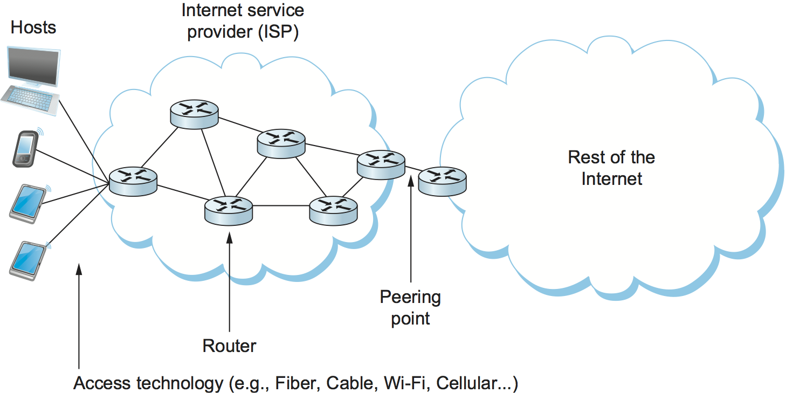

# {{Paj.Toe}}

正如我们在第1章中看到的,网络是由两类硬件构建块构成的: *结点*和*链接*. 在本章中,我们将重点介绍如何建立有用的链接,以便能够构建包含数百万个链接的大型ㄡ可靠的网络. 

<figure class="line">
	
	
	<figcaption>An end-user's view of the  Internet.</figcaption>
</figure>

当大型网络的运营商处理连接冰箱大小的路由器的跨越几百或几千公里的链接时,网络的典型用户遇到的链接主要是作为将计算机连接到全球互联网的一种方式. 有时,这个链接是咖啡店中的无线 (Wi-Fi) 链接;有时是办公楼或大学的以太网链接;对于人口中越来越大 (而且幸运) 的一部分人来说,它是由电信公司或ISP提供的光纤链接;还有许多其他的用途某种铜线或电缆连接. 幸运的是,对于这些看似完全不同的链接类型,使用了许多常见的策略,使得它们都能够对协议栈中的较高层可靠和有用. 本章将探讨这些策略. 

[图1](#isp-access)说明了典型的终端用户今天的互联网所看到的各种类型的链接. 在左边,我们看到各种各样的终端用户设备,从移动电话到PDA,再到通过各种方式连接到互联网服务提供商的成熟的计算机. 虽然这些链接可以是上面提到的任何类型,或者某种其他类型,但是在这张图片中,它们看起来都是一样的ℴℴ一条将设备连接到路由器的直线. 此外,在ISP内部也有一些链接将路由器连接在一起,还有一个链接将ISP连接到"因特网的其余部分",该链接由许多其他ISP和它们连接的主机组成. 这些链接看起来都一样,不仅仅是因为我们不是很好的艺术家,而是因为网络体系结构的部分作用是提供一个像链接一样复杂和多样化的事物的公共抽象. 这个想法是,你的笔记本电脑或智能手机不必关心它连接到哪种链接,唯一重要的是它有一个到互联网的链接. 类似地,路由器不必关心什么类型的链路将它连接到其他路由器ℴℴ它可以在链路上发送一个分组,并且非常期望该分组将到达链路的另一端. 

我们如何使所有这些不同类型的链接看起来与终端用户和路由器足够相似?本质上,我们必须处理现实世界中存在的所有物理限制和缺点. 我们在本章的开题陈述中勾画出了一些问题. 第一个问题是,链接是由一些可以传播信号 (如无线电波或其他类型的电磁辐射) 的物理材料制成的,但是我们真正想做的是发送*位*. 在本章的后面几节中,我们将介绍如何在物理介质上为传输对位进行编码,然后是上面提到的其他问题. 在本章的末尾,我们将了解如何通过几乎任何类型的链接发送完整的数据包,不管涉及到什么物理介质. 

## 链接类

虽然本书的大多数读者可能都遇到过至少几种不同类型的链接,但它将有助于理解存在的链接的一些广泛类别及其一般属性. 首先,所有实际链路都依赖于某种电磁辐射通过介质传播,或者在某些情况下,通过自由空间传播. 那么,描述链路的一个方法是通过它们使用的媒介ℴℴ典型地是某种形式的铜线,如在数字用户线(DSL)和同轴电缆中;光纤,如在商业光纤到家庭服务和因特网骨干中的许多长途链路中;或用于无线链路. 

另一个重要的环节特征是*频率*以赫兹为单位测量的,电磁波在其中振荡. 波的一对相邻最大值或最小值之间的距离,通常用米来测量,称之为波. *波长*. 因为所有的电磁波都以光速传播 (光速又取决于介质) ,所以速度除以波的频率等于波长. 我们已经看到过话音级电话线的例子,它携带300赫兹到3300赫兹之间的连续电磁信号;通过铜传播的300赫兹波具有

 StopFutListCopop/频率

$= 2/3倍3乘10 10 ^ 8/300美元

$ 667=10倍3 ^米$$

通常,电磁波跨越范围更广的频率范围,从无线电波ㄡ红外光ㄡ可见光ㄡX射线和伽马射线不等. [图2](#spectrum)描述电磁频谱,并显示哪些介质通常用于携带哪些频带. 

<figure class="line">
	
	
	<figcaption>Electromagnetic spectrum.</figcaption>
</figure>

到目前为止,我们理解了一个链路,它是以电磁波的形式携带信号的物理介质. 这样的链接为传输各种信息提供了基础,包括我们感兴趣的传输二进制数据 (1s和0s) 的数据类型. 我们说二进制数据是*编码的*在信号中. 将二进制数据编码到电磁信号上的问题是一个复杂的课题. 为了帮助主题更易于管理,我们可以把它分为两层. 下层与*调制*-改变信号的频率ㄡ振幅或相位,以实现信息的传输. 调制的一个简单例子是改变单个波长的功率 (振幅) . 直观地说,这相当于打开和关闭灯. 因为调制问题次于将链路作为计算机网络的构建块的讨论,所以我们简单地假设可以传输一对可区分的信号,把它们看作"高"信号和"低"信号,并且我们只考虑上层,即S涉及将二进制数据编码到这两个信号上的更简单的问题. 下一节讨论这样的编码. 

另一种分类链接的方法是如何使用它们. 各种经济和部署问题往往会影响到不同的链接类型被发现. 大多数消费者要么通过无线网络 (他们在咖啡店ㄡ机场ㄡ大学等处遇到) 要么通过互联网服务提供商提供的所谓的"最后一英里"链接与互联网进行交互,如前面所描述的[图形](#isp-access). 这些链接类型归纳为[表1](#home). 之所以选择DSL,通常是因为它们是触及数百万消费者的具有成本效益的方法;例如,DSL部署在现有的双绞铜线上,而双绞铜线已经用于普通老式电话服务. 这些技术中的大多数都不足以从头构建完整的网络ℴℴ例如,您可能需要一些到大型网络中互连城市的远程ㄡ非常高速的链接. 

| 服务           | 带宽 (典型)           |
| ------------ | ----------------- |
| 拨号           | 23-56 kbps        |
| 综合业务数字网      | 64-128kbps        |
| DSL          | 128 kbps-100 Mbps |
| 有线电视 (有线电视)  | 1-40 Mbps         |
| 光纤到户 (光纤到户)  | 50 Mbps-1 Gbps    |

*表1. 可连接家庭的常用服务. *

现代远程链路几乎全是光纤,同轴电缆在过去几十年里已经被大量替换. 这些链路通常使用一种叫做SONET (同步光网络) 的技术,它是为了满足电话运营商的管理要求而开发的. 稍后我们将仔细研究SONET. 

最后,除了最后一英里和骨干链接之外,还有在建筑物或校园内找到的链接,通常称为*局域网* (LAN) . 以太网,在后面的部分中描述. 一段时间以来,在这个空间中占主导地位的技术,多年来取代令牌环技术. 虽然以太网继续流行,但是它现在主要与基于802.11标准的无线技术一起出现,我们将在后面的部分中讨论. 

这个链接类型的调查绝非详尽无遗,但应该让您体验到存在的链接类型的多样性以及这种多样性的一些原因. 在接下来的章节中,我们将看到网络协议如何利用这种多样性,并且尽管存在所有低级别的复杂性,但是向更高层呈现网络的一致视图. 
