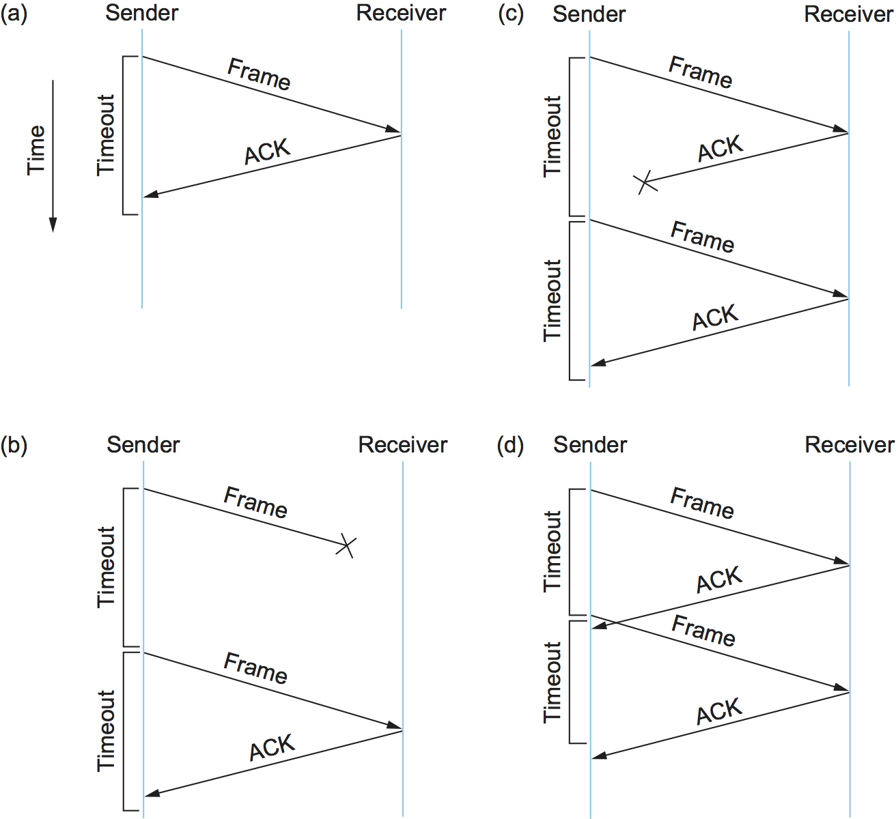

# {{Paj.Toe}}

正如我们在前一节中看到的那样,帧在传输过程中有时会被损坏,其中有一个类似于CRC的错误代码用来检测这些错误. 虽然一些错误代码也足够强大,以纠正错误,在实践中,开销通常太大,无法处理可以在网络链路上引入的位和突发错误的范围. 即使使用纠错码 (例如,在无线链路上) ,一些错误也会太严重而无法纠正. 因此,必须丢弃一些损坏的帧. 想要可靠地传递帧的链路级协议必须以某种方式从这些丢弃的 (丢失) 帧中恢复. 

值得注意的是可靠性是一个函数. *可以*在链路级提供,但许多现代链路技术省略了这个功能. 此外,在更高的层次上经常提供可靠的交付,包括传输,有时也包括应用层. 确切地说,它应该被提供是一个有争议的问题,取决于许多因素. 我们在这里描述了可靠传递的基础知识,因为原则是跨层通用的,但是您应该知道我们不仅仅是在讨论链路层函数. 

这通常是通过两个基本机制的组合来完成的. *致谢*和*超时*. 确认 (ACK) 是一个小的控制帧,协议将此控制帧发送回对等方,表示它已经接收到较早的帧. 控制帧是指没有任何数据的报头,尽管协议可以*背驮*一个数据帧上的ACK恰好是向相反的方向发送的. 接收到的确认指示原始帧的发送方其帧已成功传递. 如果发送者在合理的时间之后没有收到确认,那么*重发*原来的框架. 这种等待合理时间的行为称为*超时*.

使用确认和超时来实现可靠交付的一般策略有时称为*自动重复请求* (缩写ARQ) . 本节描述使用通用语言的三种不同的ARQ算法;即,我们不给出关于特定协议的报头字段的详细信息. 

## 停下来等待

最简单的ARQ方案是*停下来等待*算法. 停止等待的概念很简单: 在发送一个帧之后,发送者在发送下一个帧之前等待确认. 如果确认在一段时间之后没有到达,发送者超时并重发原始帧. 

<figure class="line">
	<a id="ack-timeout"></a>
	
	<figcaption>Timeline showing four different scenarios for the
	stop-and-wait algorithm. (a) The ACK is received before the timer
	expires; (b) the original frame is lost; (c) the ACK is lost;
	(d) the timeout fires too soon.</figcaption>
</figure>

[图1](#ack-timeout)说明了由这个基本算法产生的四个不同场景的时间线. 发送端在左侧表示,接收侧被描绘在右边,时间从上到下流动. [图1 (a) ](#ack-timeout)显示定时器到期之前接收到ACK的情况;(b)和(c)分别显示原始帧和ACK丢失的情况;(d)显示超时过早触发的情况. 回想一下,所谓"丢失"是指帧在运输过程中被损坏,这种损坏是由接收器上的错误代码检测到的,并且帧随后被丢弃. 

本节中所示的数据包时间线是在教学ㄡ解释和设计协议中经常使用的工具的示例. 它们很有用,因为它们可以直观地捕捉分布式系统的行为,而这些行为可能很难分析. 在设计协议时,您通常必须为意外情况做好准备ℴℴ系统崩溃ㄡ消息丢失,或者您期望快速发生的事情需要很长时间. 这些类型的图通常可以帮助我们理解在这种情况下可能出错的地方,从而帮助协议设计人员为各种可能发生的情况做好准备. 

在停止和等待算法中有一个重要的微妙之处. 假设发送者发送一个帧,接收者确认它,但是确认在到达时丢失或延迟. 这种情况在时间线 (c) 和 (d) 中示出. [图1](#ack-timeout). 在这两种情况下,发送方都超时并重传原始帧,但是接收方会认为它是下一帧,因为它正确地接收并确认了第一帧. 这有可能导致要复制的帧的复制副本. 为了解决这个问题,停止等待协议的报头通常包括1位序列号,即,序列号可以取值0和1,并且用于每个帧的序列号是交替的,如下所示[图2](#stop-wait). 因此,当发送方重新发送帧0时,接收机可以确定它正在看到帧0的第二副本,而不是帧1的第一副本,因此可以忽略它 (如果第一ACK丢失,接收机仍然确认它) . 

<figure class="line">
	<a id="stop-wait"></a>
	
	<figcaption>Timeline for stop-and-wait with 1-bit sequence
	number.</figcaption>
</figure>

停止等待算法的主要缺点是,它允许发送方一次在链路上只有一个未完成的帧,而这可能远远低于链路的容量. 例如,考虑一个1.5Mbps的链路,具有45毫秒的往返时间. 该链路的延迟为$$ \\ $ $ $乘积为67.5 kb,或约8 kb. 由于发送方只能发送每帧RTT一帧,并且假设帧大小为1×KB,这意味着最大发送速率为

位/帧/时间每帧=1024 $ $\\ $ $ 8 / 0.045=182 kbps 

或者大约八分之一的链路容量. 为了充分利用链接,我们希望发送方在等待确认之前能够发送多达8个帧. 

延迟$$$乘以$$产品的意义在于它代表了可能在传输中的数据量. 我们希望能够在不等待第一次确认的情况下发送大量数据. 这里的工作原理通常被称为*管满*. 在下面两个部分中给出的算法正好做到这一点. 

## 滑动窗口

再考虑一个场景,其中链接有延迟$$ \\ $ $带宽产品8 kb和帧是1×kb的大小. 我们希望发送者在第一帧的ACK到达几乎相同的时刻准备好发送第九帧. 允许我们这样做的算法叫做*滑动窗口*,并给出了一个说明性的时间线. [图3](#slide-win).

<figure class="line">
	<a id="slide-win"></a>
	
	<figcaption>Timeline for the sliding window algorithm.</figcaption>
</figure>

### 滑动窗口算法

滑动窗口算法的工作原理如下: 首先,发送者分配一个*序列号*,表示`SeqNum`,对每一帧. 现在,让我们忽略这样一个事实`SeqNum`由有限大小的报头字段实现,而假定它可以无限大地增长. 发送者维护三个变量: *发送窗口大小*,表示`SWS`,给出发送者可以发送的未完成 (未确认) 帧的数目的上界;`LAR`表示序列号. *最后确认收到*和`LFS`表示序列号. *最后发送帧*. 发送者还保持以下不变量: 

`LFS - LAR <= SWS`

这种情况在[图4](#sw-sender).

<figure class="line">
	<a id="sw-sender"></a>
	
	<figcaption>Sliding window on sender.</figcaption>
</figure>

当应答到达时,发送方移动. `LAR`向右,从而允许发送者发送另一帧. 此外,发送方将定时器与其发送的每个帧相关联,如果定时器在接收ACK之前过期,则发送方将重新发送该帧. 请注意,发送者必须愿意缓冲. `SWS`帧,因为它必须准备好重新发送直到它们被确认为止. 

接收者保持以下三个变量: *接收窗口大小*,表示`RWS`给出了接收方愿意接受的无序帧数的上界;`LAF`表示序列号. *最大可接受帧*和`LFR`表示序列号. *接收到的最后帧*. 接收器还保持以下不变量: 

`LAF - LFR <= RWS`

这种情况在[图5](#sw-rcvr).

<figure class="line">
	<a id="sw-rcvr"></a>
	
	<figcaption>Sliding window on receiver.</figcaption>
</figure>

当具有序列号的帧时`SeqNum`到达,接收者采取以下行动. 如果`SeqNum <= LFR`或`SeqNum > LAF`然后,框架在接收器窗口的外面,并且被丢弃. 如果`LFR < SeqNum <= LAF`然后,帧在接收者的窗口内,它被接受. 现在接收机需要决定是否发送ACK. 让`SeqNumToAck`表示尚未确认的最大序列号,使得序列号小于或等于的所有帧. `SeqNumToAck`已经收到. 接收人确认收到`SeqNumToAck`,即使已经接收到较高编号的数据包. 这种确认被认为是累积的. 然后设置`LFR = SeqNumToAck`并调整`LAF = LFR + RWS`.

例如,假设`LFR = 5` (即,接收方发送的最后一个ACK是序列号5) ;`RWS = 4`. 这意味着`LAF = 9`. 如果帧7和8到达,它们将被缓冲,因为它们在接收器的窗口内. 但是,由于帧6尚未到达,所以不需要发送ACK. 帧7和8据说是无序的. (从技术上讲,当帧7和8到达时,接收机可以重新发送帧5的ACK. )如果帧6随后到达,也许是因为它第一次丢失而迟到,并且必须重新发送,或者可能仅仅是延迟,接收机就确认帧8颠簸. `LFR`到8和集合`LAF`到12. 如果帧6实际上丢失了,那么在发送方将发生超时,导致它重传帧6. 

> 分组不可能在点对点链路上被延迟,但是稍后我们将看到这种算法在可能出现这种延迟的更复杂的网络中使用. 

我们注意到,当超时发生时,传输中的数据量减少,因为发送方在帧6被确认之前不能提前其窗口. 这意味着当分组丢失发生时,该方案不再保持管道满. 注意到分组丢失发生的时间越长,这个问题就越严重. 

注意,在这个例子中,接收器可以发送一个*否定确认* (NAK) 帧7一到达帧6. 然而,这是不必要的,因为发送者的超时机制足以捕捉这种情况,并且发送NACK给接收器增加了额外的复杂性. 另外,正如我们所提到的,当帧7和8到达时发送帧5的额外确认是合法的;在某些情况下,发送者可以使用重复的ACKs作为帧丢失的线索. 这两种方法通过允许早期检测分组丢失有助于提高性能. 

这一方案的另一个变化将是使用. *选择性确认*. 也就是说,接收器可以准确地确认它所接收到的帧,而不仅仅是按顺序接收的最高编号帧. 因此,在上述示例中,接收机可以确认接收帧7和8. 向发送者提供更多信息使得发送者可以更容易地保持管道完整,但增加了实现的复杂性. 

发送窗口大小是根据在给定时间内在链路上要有多少帧而选择的;`SWS`对于给定延迟$$乘以$带宽产品,很容易计算. 另一方面,接收机可以设置. `RWS`随心所欲. 两种常见的设置是`RWS = 1`这意味着接收器将不会缓冲到达无序的任何帧,并且`RWS = SWS`这意味着接收器可以缓冲发送者发送的任何帧. 设置是没有意义的`RWS > SWS`因为这是不可能的`SWS`帧到达无序状态. 

### 有限序数与滑动窗口

现在我们回到我们引入算法的一个简化ℴℴ我们假设序列号可以无限大. 在实践中,当然,帧的序列号是在某个有限大小的报头字段中指定的. 例如,3位字段意味着有八种可能的序列号,0ⅆ7. 这使得有必要重用序列号,或者用另一种方式,序列号环绕. 这引入了能够区分相同序列号的不同体现的问题,这意味着可能序列号的数量必须大于允许的未完成帧的数量. 例如,停止和等待一次允许一个突出的帧并且具有两个不同的序列号. 

假设我们在序列号空间中有一个数字比我们有可能突出的帧,也就是说,`SWS <= MaxSeqNum - 1`在哪里`MaxSeqNum`是可用序列号的数目. 这样就足够了吗?答案取决于`RWS`. 如果`RWS =  1`然后`MaxSeqNum >= SWS + 1`就足够了. 如果`RWS`等于`SWS`然后有一个`MaxSeqNum`只有一个大于发送窗口大小不够好. 要看到这一点,考虑一下我们有八个序列号0到7的情况,以及`SWS = RWS = 7`. 假设发送器发送帧0ⅆ6,它们被成功接收,但是丢失了ACK. 接收器现在期待帧$ 7, 0ⅆ5,但是发送者超时并发送帧0ⅆ6. 不幸的是,接收机预期帧0ⅆ5的第二化身,但得到这些帧的第一化身. 这正是我们想要避免的情况. 

结果表明,发送窗口大小可以不大于可用序列号的一半. `RWS = SWS`或更确切地说,

`SWS < (MaxSeqNum + 1)/ 2`

直观地说,这就是说,滑动窗口协议在序列号空间的两半之间交替,就像停止和等待在序列号0和1之间交替一样. 唯一的区别是,它在两个半部之间不断滑动,而不是在它们之间离散地交替. 

请注意,此规则是针对特定情况的. `RWS = SWS`. 我们把它作为一个练习来确定对于任意值的更一般的规则. `RWS`和`SWS`. 还请注意,窗口大小和序列号空间之间的关系取决于这样一种假设,即帧在运输中不被重新排序,这种假设是如此明显,以至于很容易忽略. 这不能发生在直接点到点链路上,因为在传输过程中一帧不能超过另一帧. 然而,我们将看到在不同环境中使用的滑动窗口算法,并且我们需要设计另一个规则. 

### 滑动窗口的实现

下面的例程说明了如何实现滑动窗口算法的发送和接收端. 例程取自一个工作协议,称为滑动窗口协议 (SWP) . 为了不考虑协议图中相邻的协议,我们将位于SWP之上的协议表示为高级协议 (HLP) ,而位于SWP之下的协议表示为链路级协议 (LLP) . 

我们首先定义一对数据结构. 首先,帧头非常简单: 它包含一个序列号 (`SeqNum`) 和一个确认号码 (`AckNum`) 它还包含一个`Flags`指示帧是ACK还是承载数据的字段. 

```c
typedef u_char SwpSeqno;

typedef struct {
    SwpSeqno   SeqNum;   /* sequence number of this frame */
    SwpSeqno   AckNum;   /* ack of received frame */
    u_char     Flags;           /* up to 8 bits worth of flags */
} SwpHdr;
```

接下来,滑动窗口算法的状态具有以下结构. 对于协议的发送端,该状态包括变量. `LAR`和`LFS`,如本节前面所述,以及保持已传输但尚未被确认的帧的队列 (`sendQ`) 发送状态还包括*计数信号量*打电话`sendWindowNotFull`. 我们将看到下面是如何使用的,但通常信号量是一个支持支持的同步原语. `semWait`和`semSignal`操作. 每一次调用`semSignal`将信号量递增1,并每次调用`semWait`减量`s`到1,当调用进程被阻塞 (暂停) 时,应该减去信号量使其值小于0. 在调用过程中被阻塞的进程. `semWait`将允许尽快恢复`semSignal`已经执行了操作以提高信号量大于0的值. 

对于协议的接收端,状态包括变量. `NFE`. 这就是*下一帧预期*帧的序列号是最后一帧接收到的帧 (LFR) ,在本节前面已经描述过. 还有一个队列,它保存已被无序接收的帧 (`recvQ`) 最后,虽然未示出,发送者和接收者滑动窗口大小由常数定义. `SWS`和`RWS`,分别. 

```c
typedef struct {
    /* sender side state: */
    SwpSeqno    LAR;        /* seqno of last ACK received */
    SwpSeqno    LFS;        /* last frame sent */
    Semaphore   sendWindowNotFull;
    SwpHdr      hdr;        /* pre-initialized header */
    struct sendQ_slot {
        Event   timeout;    /* event associated with send-timeout */
        Msg     msg;
    }   sendQ[SWS];

    /* receiver side state: */
    SwpSeqno    NFE;       /* seqno of next frame expected */
    struct recvQ_slot {
        int     received;  /* is msg valid? */
        Msg     msg;
    }   recvQ[RWS];
} SwpState;
```

SWP的发送端由程序实现`sendSWP`. 这个程序相当简单. 第一,`semWait`使此进程在信号量上阻塞,直到发送另一帧是可以的. 一旦允许,`sendSWP`在帧的头中设置序列号,保存发送队列中的帧副本 (`sendQ`调度超时事件以处理帧未被确认的情况,并将帧发送到下一层协议,我们表示为`LINK`.

值得注意的一个细节是`store_swp_hdr`就在召唤之前`msgAddHdr`. 这个例程转换了持有SWP报头的C结构 (`state->hdr`转换为一个字节串,它可以安全地连接到消息的前面 (`hbuf`) 这个例程 (未显示) 必须将头中的每个整数字段转换为网络字节顺序,并删除编译器添加到C结构中的任何填充. 字节顺序问题是一个非常重要的问题,但是现在假设这个例程将多字整数的最高有效位放在具有最高地址的字节中就足够了. 

这个例程的另一个复杂之处是使用`semWait`以及`sendWindowNotFull`信号量. `sendWindowNotFull`初始化为发送者的滑动窗口的大小,`SWS` (未显示此初始化) . 每次发送方发送一个帧时,`semWait`如果计数为0,则操作减去此计数并阻止发送方. 每次接收到ACK时,`semSignal`调用的操作`deliverSWP` (见下文) 递增此计数,从而解除任何等待发送器的阻塞. 

```c
static int 
sendSWP(SwpState *state, Msg *frame) 
{
    struct sendQ_slot *slot;
    hbuf[HLEN];

    /* wait for send window to open */
    semWait(&state->sendWindowNotFull);
    state->hdr.SeqNum = ++state->LFS;
    slot = &state->sendQ[state->hdr.SeqNum % SWS];
    store_swp_hdr(state->hdr, hbuf);
    msgAddHdr(frame, hbuf, HLEN);
    msgSaveCopy(&slot->msg, frame);
    slot->timeout = evSchedule(swpTimeout, slot, SWP_SEND_TIMEOUT);
    return send(LINK, frame);
}
```

在继续接收SWP之前,我们需要协调一个看似不一致的问题. 一方面,我们一直在说,高级协议通过调用`send`操作,因此我们希望通过SWP发送消息的协议将调用`send(SWP, packet)`. 另一方面,实现SWP的发送操作的过程称为`sendSWP`,它的第一个参数是一个状态变量 (`SwpState`) 给出了什么?答案是操作系统提供了将通用调用转换为`send`到特定于协议的调用`sendSWP`. 此胶粘代码将第一个参数映射到`send` (魔术协议变量) `SWP`) 到函数指针中`sendSWP`以及一个指向SWP需要执行它的工作的协议状态的指针. 我们让高级协议通过泛型函数调用间接调用特定于协议的函数的原因是,我们想限制高级协议在其中编码了多少关于低级协议的信息. 这使得将来更容易更改协议图配置. 

现在我们讨论SWP协议的具体实现. `deliver`程序中的操作`deliverSWP`. 这个例程实际上处理两种不同类型的传入消息: 针对早先从这个节点发送的帧的ACK和到达这个节点的数据帧. 从某种意义上说,这个例程的ACK一半是给定的算法的发送方的对应部分. `sendSWP`. 关于传入消息是ACK还是数据帧的决定是通过检查`Flags`标题中的字段. 请注意,该特定实现不支持在数据帧上捎带ACK. 

当传入帧是ACK时,`deliverSWP`简单地找到传输队列中的时隙 (`sendQ`) 对应于ACK,取消超时事件,并释放在该时隙中保存的帧. 这项工作实际上是在一个循环中完成的,因为ACK可以是累加的. 唯一需要注意的是调用子程序. `swpInWindow`. 下面给出的这个子例程确保被确认帧的序列号在发送方当前希望接收的ACK的范围内. 

当传入帧包含数据时,`deliverSWP`第一次通话`msgStripHdr`和`load_swp_hdr`从帧中提取头. 例行程序`load_swp_hdr`是对应的`store_swp_hdr`前面讨论过的,它将字节串转换为保存SWP头的C数据结构. `deliverSWP`然后调用`swpInWindow`确保帧的序列号在所期望的序列号范围内. 如果是,则例程循环遍历它已接收的连续帧集,并通过调用`deliverHLP`例行公事. 它还发送一个累积的ACK返回到发送者,但是通过在接收队列上循环来实现它 (它不使用`SeqNumToAck`在本节前面给出的散文描述中使用的变量. 

```c
static int 
deliverSWP(SwpState state, Msg *frame) 
{
    SwpHdr   hdr;
    char     *hbuf;

    hbuf = msgStripHdr(frame, HLEN);
    load_swp_hdr(&hdr, hbuf) 
    if (hdr->Flags & FLAG_ACK_VALID) 
    {
        /* received an acknowledgment—do SENDER side */
        if (swpInWindow(hdr.AckNum, state->LAR + 1, state->LFS)) 
        {
            do 
            {
                struct sendQ_slot *slot;

                slot = &state->sendQ[++state->LAR % SWS];
                evCancel(slot->timeout);
                msgDestroy(&slot->msg);
                semSignal(&state->sendWindowNotFull);
            } while (state->LAR != hdr.AckNum);
        }
    }

    if (hdr.Flags & FLAG_HAS_DATA) 
    {
        struct recvQ_slot *slot;

        /* received data packet—do RECEIVER side */
        slot = &state->recvQ[hdr.SeqNum % RWS];
        if (!swpInWindow(hdr.SeqNum, state->NFE, state->NFE + RWS - 1)) 
        {
            /* drop the message */
            return SUCCESS;
        }
        msgSaveCopy(&slot->msg, frame);
        slot->received = TRUE;
        if (hdr.SeqNum == state->NFE) 
        {
            Msg m;

            while (slot->received) 
            {
                deliver(HLP, &slot->msg);
                msgDestroy(&slot->msg);
                slot->received = FALSE;
                slot = &state->recvQ[++state->NFE % RWS];
            }
            /* send ACK: */
            prepare_ack(&m, state->NFE - 1);
            send(LINK, &m);
            msgDestroy(&m);
        }
    }
    return SUCCESS;
}
```

最后,`swpInWindow`是一个简单的子程序,检查给定的序列号是否落在某个最小和最大序列号之间. 

```c
static bool 
swpInWindow(SwpSeqno seqno, SwpSeqno min, SwpSeqno max) 
{
    SwpSeqno pos, maxpos;

    pos    = seqno - min;       /* pos *should* be in range [0..MAX) */
    maxpos = max - min + 1;     /* maxpos is in range [0..MAX] */
    return pos < maxpos;
}
```

### 帧序与流量控制

滑动窗口协议也许是计算机网络中最著名的算法. 然而,该算法容易混淆的是,它可以用于服务三个不同的角色. 第一个角色是我们在本节中一直致力于可靠地传递框架的一个不可靠的链接.  (通常,该算法可用于在不可靠的网络上可靠地传递消息. ) 这是算法的核心功能. 

滑动窗口算法可以服务的第二个作用是保持帧被传输的顺序. 这在接收机上很容易做到-因为每个帧都有序列号,所以接收机只是确保它不会把帧传递到下一个更高级别的协议,直到它已经传递了具有较小序列号的所有帧. 也就是说,接收器缓冲器 (即,不传递) 无序帧. 本节中描述的滑动窗口算法的版本确实保持了帧顺序,尽管我们可以想象接收机在不等待所有较早的帧被传送的情况下将帧传送到下一协议的变化. 我们应该问自己的一个问题是,我们是否真的需要滑动窗口协议来保持帧的顺序,或者相反,在链接级别,这是否是不必要的功能. 不幸的是,我们还没有看到足够的网络体系结构来回答这个问题;我们首先需要理解如何通过交换机连接点对点链路序列以形成端到端路径. 

滑动窗口算法有时发挥的第三个作用是支持*流量控制*-一种反馈机制,通过该机制,接收器能够节制发送器. 这种机制用于防止发送方超负荷运行接收器,也就是说,避免发送超过接收器能够处理的数据. 这通常通过增强滑动窗口协议来完成,以便接收机不仅确认它已经接收的帧,而且还通知发送器它有多少帧可以接收. 接收机能够接收的帧数对应于它有多少空闲缓冲空间. 如同订单交付的情况一样,在将流控制合并到滑动窗口协议之前,我们需要确保在链接级别有必要进行流控制. 

一个重要的概念要远离这个讨论是我们所称的系统设计原则. *关注分离*. 也就是说,必须小心区分有时在一个机制中组合在一起的不同函数,并且必须确保每个函数都是必需的,并且以最有效的方式得到支持. 在这种情况下,可靠交付ㄡ有序交付和流量控制有时结合在单个滑动窗口协议中,我们应该问自己,在链接级别这是否是正确的事情. 

## 并发逻辑信道

ARPANET中使用的数据链路协议提供了滑动窗口协议的一个有趣的替代方案,因为它能够保持管道满,同时仍然使用简单的停止等待算法. 这种方法的一个重要结果是,在给定链路上发送的帧不以任何特定的顺序保持. 该协议也不涉及流量控制. 

ARPANET协议的基础概念,我们称之为*并发逻辑信道*即,将多个逻辑信道复用到单个点对点链路上,并在每个逻辑信道上运行停止等待算法. 在任何逻辑信道上发送的帧之间没有保持关系,但是因为不同的帧可以在多个逻辑信道中的每个上突出,所以发送者可以保持链路完整. 

更准确地说,发送方为每个信道保持3比特的状态: 布尔值,表示信道当前是否繁忙;1比特序列号,用于下次在该逻辑信道上发送帧时使用;以及下一个序列号,用于预期在该信道上到达的帧上. 当节点有一个要发送的帧时,它使用最低空闲信道,否则它的行为就像停止和等待. 

在实践中,ARPANET在每个地面链路上支持8个逻辑信道,并且在每个卫星链路上支持16个逻辑信道. 在地面链路的情况下,每个帧的头部包括3位信道号和1位序列号,总共4位. 这正好是滑动窗口协议需要在链路上支持多达8个优秀帧的位数. `RWS = SWS`.
