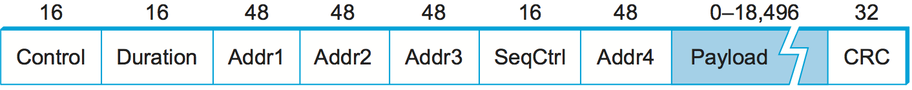

# {{Paj.Toe}}

无线技术在某些重要的方面与有线链路不同,同时共享许多公共属性. 与有线链路一样,比特错误的问题也非常令人关注ℴℴ通常由于大多数无线链路的不可预测噪声环境而更加如此. 框架和可靠性也必须加以解决. 与有线链路不同,电力对于无线来说是一个大问题,特别是因为无线链路经常被访问电力(例如,小电池)有限的小型移动设备(如电话和传感器)使用. 此外,你不能用无线电发射机以任意高的功率发射出去ℴℴ人们担心与其他设备的干扰,并且通常规定一个设备在任何给定频率下可以发射多少功率. 

无线媒体本质上也是多址的;很难将无线传输直接指向单个接收器,或者避免从附近任何具有足够功率的发射机接收无线电信号. 因此,媒体接入控制是无线链路的核心问题. 而且,因为很难控制谁在通过空中传输时接收到您的信号,所以可能还必须解决窃听问题. 

各种各样的无线技术令人困惑,每种技术都在不同的维度上做出不同的权衡. 对不同技术进行分类的一种简单方法是根据它们提供的数据速率和通信节点可以相距多远. 其他重要的区别包括它们使用电磁频谱的哪个部分 (包括是否需要许可证) 以及它们消耗多少功率. 在本节中,我们将讨论三种主要的无线技术: Wi-Fi (更正式地称为802.11) ㄡ蓝牙,以及第三代或"3G"系列蜂窝无线标准. [表1](#wirelessTechnologiesTable)给出了这些技术的概述以及它们是如何相互比较的. 

|        | 蓝牙 (802.151)  | Wi-Fi (802.11)  | 3G蜂窝           |
| ------ | ------------- | --------------- | -------------- |
| 典型链路长度 | 10米           | 100米            | 几十公里           |
| 典型数据率  | 2 Mbps (共享)   | 54 Mbps (共享)    | 数百kbps (每个连接)  |
| 典型用途   | 将外围设备连接到计算机上  | 将计算机连接到有线基站     | 把手机连接到有线电视塔    |
| 有线技术类比 | 通用串口总线        | 以太网             | DSL            |

*表1. 领先的无线技术综述*

你可能记得,带宽有时意味着赫兹的频带宽度,有时是链路的数据速率. 因为这两个概念都出现在无线网络的讨论中,所以我们将使用. *带宽*这里的频带宽度更宽,使用术语*数据速率*描述可以通过链路发送的每秒比特数,如[表1](#wirelessTechnologiesTable).

因为无线链路都共享相同的介质,所以面临的挑战是有效地共享该介质,而不会过度地相互干扰. 大部分的共享是通过沿着频率和空间的维度来划分的. 特定地理区域中特定频率的专用性可分配给诸如公司之类的单个实体. 限制电磁信号覆盖的区域是可行的,因为这样的信号减弱,或者*衰减*,与他们的起源距离. 为了减少信号覆盖的面积,减少发射机的功率. 

这些拨款通常由政府机构决定,例如美国的联邦通信委员会 (FCC) . 特定频带 (频率范围) 被分配给某些用途. 有些乐队是为了政府的使用而保留的. 其他频带被保留用于诸如AM无线电ㄡFM无线电ㄡ电视ㄡ卫星通信和蜂窝电话等用途. 然后将这些频带内的特定频率授权给个别组织,以便在某些地理区域内使用. 最后,为不需要许可证的免许可使用频带设置多个频带. 

使用免许可频率的设备仍然受到某些限制,以使得原本不受限制的共享工作正常. 其中最重要的是对传输功率的限制. 这限制了信号的范围,使得它不太可能干扰另一个信号. 例如,一个无绳电话 (一个普通的无执照设备) 可能有一个大约100英尺的范围. 

当频谱在许多设备和应用中共享时,会出现很多想法. *扩频*. 扩频背后的思想是将信号扩展到更宽的频带,以便最小化来自其他设备的干扰的影响.  (扩频最初是为军事用途设计的,所以这些"其他设备"经常试图干扰信号. ) *跳频*是一种扩频技术,包括在一个频率的随机序列上发送信号,即,在一个频率上首先发射,然后在第二个频率,然后第三个发射,等等. 频率序列不是真正随机的,而是由伪随机数发生器计算算法. 接收器使用与发送器相同的算法并用相同的种子初始化它,因此,它能够跳频与发射机同步以正确地接收帧. 该方案通过使两个信号不可能使用同一频率多于不常见的孤立比特而减少干扰. 

第二种扩频技术,叫做*直接序列*增加冗余,以获得更大的干扰容忍度. 每个数据比特由发送信号中的多个比特表示,因此,如果一些传输比特受到干扰损坏,则通常有足够的冗余来恢复原始比特. 对于发送者想要发送的每个比特,它实际上发送该比特和N个随机比特的异或. 与跳频一样,随机比特序列是由发送方和接收方都知道的伪随机数生成器生成的. 发送的值,称为N位. *碎码*将信号传播到比帧需要的N倍宽的频带上. [图1](#chipping)给出了一个4位削波序列的例子. 

<figure class="line">
	
	
	<figcaption>Example 4-bit chipping sequence.</figcaption>
</figure>

电磁频谱的不同部分具有不同的性质,使得一些更适合于通信,而另一些则不那么适合. 例如,有些可以穿透建筑物,有些则不能穿透. 政府只调整主要的通信部分: 无线电和微波范围. 随着对主频谱的需求增加,随着模拟电视逐步淘汰而转向数字电视,人们对频谱越来越感兴趣. 

在今天的许多无线网络中,我们观察到端点有两个不同的类. 一个端点,有时被描述为*基站*,通常不具有移动性,但与因特网或其他网络具有有线 (或至少高带宽) 连接,如图所示[图2](#wirelessBaseStation). 链路另一端的节点 (这里显示为客户端节点) 通常是移动的,并且依赖于其与基站的链路来完成与其他节点的所有通信. 

观察到[图2](#wirelessBaseStation)我们已经使用一对波浪线来表示在两个设备之间提供的无线"链路"抽象 (例如,在基站与其一个客户端节点之间) . 无线通信的有趣方面之一是它自然地支持点对多点通信,因为一个设备发送的无线电波可以被许多设备同时接收. 然而,为更高层协议创建点对点链接抽象通常是有用的,我们将在本节后面看到如何工作的示例. 

请注意[图2](#wirelessBaseStation)非基站 (客户端) 节点之间的通信经由基站路由. 尽管一个客户端节点发射的无线电波可以被其他客户端节点很好地接收,但是公共基站模型不允许客户端节点之间的直接通信. 

<figure class="line">
	
	
	<figcaption>A wireless network using a base station.</figcaption>
</figure>

这种拓扑结构意味着三种质量不同的迁移率水平. 第一级是不移动的,例如当接收机必须位于固定位置以接收来自基站的定向传输时. 第二级是在基站范围内的移动性,蓝牙也是如此. 第三个层次是基站之间的移动性,手机和Wi-Fi也是如此. 

<figure class="line">
	
	
	<figcaption>A wireless ad hoc or mesh network.</figcaption>
</figure>

另一种越来越感兴趣的拓扑结构是*网格*或*自组织网络*网络. 在无线网格中,节点是对等的,也就是说,没有特殊的基站节点. 只要每个节点在前面的节点的范围内,消息可以通过对等节点链转发. 这说明了[图3](#wirelessMesh). 这允许网络的无线部分延伸到单个无线电的有限范围之外. 从技术之间竞争的角度来看,这允许短距离技术扩展其范围,并可能与长距离技术竞争. 网格还通过为消息提供从A点到B点的多条路由来提供容错性. 网格网络可以以增量的成本进行增量的扩展. 另一方面,网状网络要求非基础节点在其硬件和软件方面具有一定程度的复杂性,潜在地增加单位成本和功耗,这是电池供电设备的重要考虑. 无线网状网络具有相当大的研究兴趣 (参见进一步的阅读部分以获得一些参考) ,但是与具有基站的网络相比,它们仍然处于相对的幼稚阶段. 无线传感器网络是一种新兴的热点技术,经常形成无线网格. 

现在我们已经讨论了一些常见的无线问题,下面让我们看一些常见无线技术的细节. 

## 802.11/Wi-Fi

大多数读者将使用基于IEEE 802.11标准的无线网络,通常称为*无线局域网*. Wi-Fi在技术上是一个商标,由一个名为Wi-Fi联盟的商业团体拥有,该联盟认证产品符合802.11. 与以太网一样,802.11被设计用于有限的地理区域 (家庭ㄡ办公大楼ㄡ校园) ,其主要挑战是调解对共享通信介质的访问,在这种情况下,调解通过空间传播的信号. 

### 物理性质

802.11定义了许多不同的物理层,这些物理层在不同的频带中工作,并提供一系列不同的数据速率. 在写入时,802.11n提供最高的最大数据速率,以600 Mbps为最高. 

最初的802.11标准定义了两个基于无线电的物理层标准,一个使用跳频 (超过791-MHz的宽频带宽) ,另一个使用直接序列扩频 (具有11位的芯片序列) . 两者都提供了在2μMbps范围内的数据速率. 随后添加物理层标准802.11b. 使用直接序列的变体,802.11b提供高达11μMbps. 这三个标准都在电磁频谱的免许可2.4-GHz频带中运行. 然后是802.11a,它使用FDM的一个变体来提供高达54μMbps的调用. *正交频分复用 (OFDM) *802.11a在免许可的5GHz频带中运行. 一方面,该频带使用较少,因此干扰较小. 另一方面,有更多的吸收信号,它被限制为几乎视线. 随后是802.11g;802.11g也使用OFDM,传输高达54Mbps,并且向后兼容802.11b (并返回到2.4-GHz频带) . 

最近802.11n已经出现在现场,其标准在2009年被批准 (尽管也存在预标准产品) . 802.11n通过使用多个天线并允许更大的无线信道带宽,在最大可能数据速率方面取得了相当大的进展. 多天线的使用经常被称为*多输入多输出*对于多输入,多输出. 

商业产品通常支持802.11种以上的风味,一些基站支持所有四种变体 (AㄡBㄡG和N) . 这不仅确保了与支持任何标准的任何设备的兼容性,而且使得两个这样的产品能够为特定环境选择最高带宽选项. 

值得注意的是,尽管所有802.11个标准都定义了一个*最大限度*可以支持的比特率,它们也主要支持较低的比特率;例如,802.11a允许比特率为6, 9, 12ㄡ18, 24, 36ㄡ48和54 Mbps. 在较低的比特率下,在存在噪声的情况下更容易解码发送信号. 使用不同的调制方案来实现不同的比特率;此外,纠错码形式的冗余信息量是变化的. (参见错误检测代码的介绍. )更多的冗余信息意味着以更低的有效数据速率为代价对比特错误具有更高的弹性(因为更多的发送比特是冗余的). 

这些系统试图基于它们所处的噪声环境来选择最佳的比特率;用于比特率选择的算法可能相当复杂 (例如,参见进一步阅读部分) . 有趣的是,802.11个标准没有指定特定的方法,而是将算法留给不同的供应商. 选择比特率的基本方法是通过直接测量物理层的信噪比(SNR)或通过测量分组成功传输和确认的频率来估计SNR,来估计比特错误率. 在某些方法中,发送者偶尔会通过以该速率发送一个或多个分组来探测更高的比特率,以查看它是否成功. 

### 避碰

乍一看,似乎无线协议将遵循与以太网相同的算法ℴℴ在发送之前等待直到链路变为空闲,在发生冲突时退避ℴℴ并且,在第一种近似中,802.11是这样做的. 无线的附加复杂性在于,虽然以太网上的节点接收每个其它节点的传输,并且可以同时发送和接收,但是这些条件对于无线节点都不成立. 这使得碰撞的检测更加复杂. 无线节点通常不能在同一时间(在同一频率上)发射和接收的原因是,发射机产生的功率可能比任何接收的功率高得多,因此淹没了接收电路. 一个节点不能从另一个节点接收传输的原因是因为该节点可能太远或者被障碍物阻塞. 这种情况比最初出现的要复杂一些,下面的讨论将说明. 

<figure class="line">
	
	
	<figcaption>The hidden node problem. Although A and C are hidden
	from each other, their signals can collide at B. (B's reach is not
	shown.)</figcaption>
</figure>

考虑下面描述的情况[图4](#wifiHiddenNode),A和C都在B的范围内,但不是彼此. 假设A和C都想与B通信,所以他们每个都给它发送一个帧. A和C不知道对方,因为他们的信号不携带那么远. 这两个帧在B处相互碰撞,但与以太网不同,NOR和C都不知道这种冲突. A和C据说是*隐藏节点*互相尊重. 

<figure class="line">
	
	
	<figcaption>The exposed node problem. Although B and C are exposed
	to each other's signals, there is no interference if B transmits
	to A while C transmits to D. (A and D's reaches are not shown.)</figcaption>
</figure>

一个相关的问题,叫做*暴露节点问题*发生在下列情况下[图5](#wifiExposedNode)其中,四个节点中的每一个都能够发送和接收仅到达其左ㄡ右节点的信号. 例如,B可以与A和C交换帧,但不能达到D,而C可以达到B和D,但不能达到A. 然而,如果C认为它不能传送给任何人只是因为它能听到B的传输,那就错了. 例如,假设C想要传输到节点D. 这不是问题,因为C到D的传输不会干扰A从B接收的能力.  (在我们的示例中,它会干扰A到B的发送,但是B正在传输) . 

802.11使用CSMA/CA解决这些问题,其中CA代表冲突. *回避*与碰撞相反*侦查*在以太网上使用的CSMA/CD. 有几件作品可以做这件事. 

载波侦听部分似乎很简单: 在发送分组之前,发送器检查它是否能听到任何其他传输;如果没有,它发送. 然而,由于隐藏终端问题,仅仅等待来自其他发射机的信号不存在并不能保证从接收机的角度来看不会发生冲突. 出于这个原因,CSMA/CA的一部分是从接收器到发送器的显式ACK. 如果分组被成功解码并在接收机上传递其CRC,则接收机向发送器发送ACK. 

注意,如果确实发生冲突,它将使整个数据包无效. 为此,802.11添加了一个可选的机制,称为RTS CTS (准备发送透明发送) . 这有助于解决隐藏终端问题. 发送方发送一个RTS-短分组-到预期的接收器,如果该分组被成功接收,接收器用另一个短分组,CTS.即使RTS可能没有被隐藏终端听到,CTS可能会是. 这有效地告诉在接收器范围内的节点,它们应该在一段时间内不发送任何东西ℴℴ预期的传输的时间量包括在RTS和CTS分组中. 在那个时间加上一个小的间隔已经过去之后,可以假设载波再次可用,并且另一个节点可以自由尝试发送. 

当然,两个节点可能检测到空闲链路,并试图同时发送RTS帧,从而导致它们的RTS帧彼此冲突. 发送者在一段时间之后没有接收到CTS帧时发生了冲突,在这种情况下,他们各自在再次尝试之前等待随机量的时间. 给定的节点延迟的时间由指数退避算法定义,非常类似于以太网上使用的. 

在成功的RTS CTS交换之后,发送方发送其数据包,并且如果一切顺利,则接收该分组的ACK. 在没有及时ACK的情况下,发送方将再次尝试使用上述相同的过程来请求使用信道. 当然,此时,其他节点也可能再次尝试访问信道. 

### 分配制度

如迄今为止所描述的,802.11将适用于具有网格的网络 (*自组织网络*拓扑和802.11s的Mesh网络标准已经接近完成. 然而,在目前的情况下,几乎所有802.11个网络都使用面向基站的拓扑结构. 

不是所有节点都被平等地创建,而是允许一些节点漫游 (例如,您的膝上型计算机) ,一些节点连接到有线网络基础设施. 802.11呼叫这些基站*接入点* (APS) ,它们通过所谓的相互连接. *分配制度*.[图6](#wireless2)说明了一种连接三个接入点的分发系统,每个接入点服务于某个区域中的节点. 每个接入点在适当频率范围内的某些信道上操作,并且每个AP通常位于与其邻居不同的信道上. 

<figure class="line">
	
	
	<figcaption>Access points connected to a distribution system.</figcaption>
</figure>

分布系统的细节对于这个讨论并不重要,例如,它可以是以太网. 唯一重要的一点是分配网络在链路层操作,与无线链路相同的协议层. 换句话说,它不依赖于任何更高级的协议 (如网络层) . 

虽然如果两个节点在彼此可及的范围内,它们可以彼此直接通信,但是这种配置背后的思想是每个节点将自己与一个接入点相关联. 例如,对于节点A与节点E进行通信,A首先向其接入点(AP-1)发送一帧,该接入点跨分布式系统将该帧转发给AP-3,AP-3最终将该帧发送给E. AP-1如何知道将消息转发给AP-3超出了802.11的范围;它可能已经使用了桥接协议. 802.11的确规定了节点如何选择它们的接入点,更有趣的是,根据从一个小区移动到另一个小区的节点,该算法如何工作. 

选择AP的技术称为*扫描*包括以下四个步骤: 

1.  节点发送一个`Probe`框架. 

2.  APS内的所有APS答复`Probe Response`框架. 

3.  节点选择其中一个接入点并发送AP AN. `Association Request`框架. 

4.  AP以一个`Association Response`框架. 

每当节点加入网络时,节点就参与该协议,以及当它对当前AP感到不满时. 这可能发生,例如,因为来自它的当前AP的信号由于节点远离它而减弱. 每当节点获得新的AP,新的AP就通过分发系统通知旧的AP (这在步骤4中发生) . 

<figure class="line">
	
	
	<figcaption>Node mobility.</figcaption>
</figure>

考虑显示的情况[图7](#wireless3)其中,节点C从AP-1服务的小区移动到AP-2服务的小区. 当它移动时,它发送`Probe`最终导致`Probe
Response`来自AP-2的帧. 在某个点,C比AP-1更喜欢AP-2,因此它将自己与接入点联系起来. 

刚才描述的机制叫做*主动扫描*由于节点正在积极地搜索接入点. APS也定期发送`Beacon`公告接入点性能的帧;这些包括AP支持的传输速率. 这叫做*被动扫描*,并且节点可以基于`Beacon`只需发送一帧`Association Request`框架返回到接入点. 

### 帧格式

802.11帧格式中的大部分,在[图8](#802.11-format)这正是我们所期望的. 该帧包含源节点地址和目的地节点地址,每个地址有48位长,多达2312字节的数据,以及32位CRC. 这个`Control`字段包含三个感兴趣的子字段 (未示出) : 6位`Type`指示帧是否承载数据的字段,是RTS帧还是CTS帧,或者正由扫描算法使用,以及一对1位字段,称为`ToDS`和`FromDS`-如下所述. 

<figure class="line">
	
	
	<figcaption>802.11 frame format.</figcaption>
</figure>

802.11帧格式的特殊之处在于它包含四个地址,而不是两个地址. 如何解释这些地址取决于`ToDS`和`FromDS`帧中的位`Control`字段. 这是为了说明帧必须跨分发系统转发的可能性,这意味着原始发送者不一定与最近的发送节点相同. 类似的推理适用于目的地地址. 在最简单的情况下,当一个节点直接发送到另一个节点时,`DS`比特数为0,`Addr1`标识目标节点,以及`Addr2`标识源节点. 在最复杂的情况下,两者都`DS`比特被设置为1,指示消息从无线节点到分发系统,然后从分发系统到另一无线节点. 双位设置,`Addr1`确定最终目的地,`Addr2`标识即时发送者 (将帧从分发系统转发到最终目的地) ;`Addr3`标识中间目的地 (从无线节点接收帧并在分发系统中转发该帧的目的地) ,以及`Addr4`标识原始源代码. 在给出的例子中[图6](#wireless2),`Addr1`对应于E,`Addr2`标识AP-3,`Addr3`对应于AP-1,以及`Addr4`识别A

## 蓝牙 (802.151) 

蓝牙技术填补了手机ㄡPDAㄡ笔记本电脑和其他个人或外围设备之间非常短距离通信的空白. 例如,蓝牙可用于将手机与耳机或笔记本电脑连接到键盘. 粗略地说,蓝牙是用电线连接两个设备的一个更方便的选择. 在这样的应用中,不必提供太多的范围或带宽. 这意味着蓝牙无线电可以使用相当低的功率传输,因为传输功率是影响无线链路的带宽和范围的主要因素之一. 这与支持蓝牙的设备的目标应用相匹配ℴℴ它们中的大多数是电池供电的 (例如无处不在的电话耳机) ,因此它们不消耗很多电力是很重要的. 

蓝牙在2.45 GHz的免许可频带中运行. 蓝牙链路具有大约1到3Mbps的典型带宽和大约10m的范围. 因此,由于通信设备通常属于一个个人或组,因此有时将蓝牙归类为个人区域网络(PAN). 

蓝牙是由一个名为*蓝牙特别兴趣小组*. 它指定了一整套协议,超越链路层来定义它所调用的应用协议. *轮廓*,适用于多种应用场合. 例如,有一个PDA与个人计算机同步的配置文件. 另一个配置文件允许移动计算机以802.11的方式访问有线LAN,尽管这不是蓝牙最初的目标. IEEE 802.151标准是基于蓝牙的,但不包括应用协议. 

基本的蓝牙网络配置,称为*微微网*由一个主设备和多达七个从设备组成,如图所示[图9](#wirelessBluetoothPiconet). 任何沟通都是在主人和奴隶之间,奴隶之间不直接沟通. 因为奴隶有一个更简单的角色,他们的蓝牙硬件和软件可以更简单和更便宜. 

<figure class="line">
	
	
	<figcaption>A Bluetooth piconet.</figcaption>
</figure>

由于蓝牙在免许可频带中操作,因此需要使用扩频技术 (如本节开始所讨论的) 来处理频带中可能的干扰. 它使用79的跳频. *渠道* (频率) ,每次使用625美元$MU $ S一次. 这提供了用于同步时分复用的蓝牙的自然时隙. 一个帧占用1, 3个或5个连续的时隙. 只有主机才能开始在奇数槽中传输. 从设备可以开始在偶数时隙中发送,但仅在前一时隙期间响应来自主设备的请求,从而防止从设备之间的任何争用. 

从设备可以是*停放的*也就是说,它被设置为一个不活跃的,低功耗的状态. 停放的设备不能在微微网上通信,只能由主机重新激活. 微微网除了它的主动从设备之外,还可以有多达255个停放设备. 

在低功耗ㄡ短距离通信领域,除了蓝牙之外,还有其他一些技术. 其中之一是ZigBee,由ZigBee联盟设计并标准化为IEEE 802.15.4. 它被设计用于带宽要求低ㄡ功耗必须非常低以获得非常长的电池寿命的情况. 它也比蓝牙更简单ㄡ更便宜,使其能够在更便宜的设备中加入,例如*传感器*. 随着技术发展到可以大量部署非常便宜的小型设备来监测建筑物中的温度ㄡ湿度和能量消耗的程度,传感器正成为越来越重要的一类网络化设备. 

## 手机技术

虽然蜂窝电话技术开始于语音通信,但是基于蜂窝标准的数据服务已经变得越来越流行 (部分由于移动电话或移动电话的增强能力,*智能手机*) 与刚才描述的技术相比,一个缺点往往是用户的成本,这部分是由于蜂窝使用许可频谱 (该频谱在历史上以天文数字出售给移动电话运营商) . 用于蜂窝电话的频段 (现在用于蜂窝数据) 在世界各地有所不同. 例如,在欧洲,蜂窝电话的主要波段为900 MHz和1800 MHz. 在北美洲,使用850兆赫和1900兆赫频段. 频谱使用的这种全球变化给想要从世界一个地方旅行到另一个地方的用户带来了问题,并且为能够以多种频率工作的电话创造了市场(例如,三频电话可以在上述四个频带中的三个频带工作). 然而,与困扰蜂窝通信业务的不兼容标准的激增相比,这个问题显得苍白无力. 只是最近出现了一些趋同迹象,出现了一系列小的标准. 最后,还有一个问题,因为大多数蜂窝技术是为语音通信而设计的,所以高带宽数据通信是标准中相对较新的附加技术. 

与802.11和WiMAX一样,蜂窝技术依赖于作为有线网络的一部分的基站的使用. 基站天线所服务的地理区域称为*细胞*. 基站可以服务于单个小区,或者使用多个定向天线来服务多个小区. 细胞没有清晰的边界,它们重叠. 在它们重叠的地方,移动电话可以与多个基站进行通信. 这有点类似于图中所示的802.11幅图. [图6](#wireless2). 然而,在任何时候,电话都在与一个基站通信,而在控制之下,只有一个基站. 当电话开始离开一个小区时,它移动到与一个或多个其他小区重叠的区域. 当前基站感知来自电话的削弱信号,并将电话的控制权给予从其接收最强信号的任何基站. 如果电话当时涉及到呼叫,则必须将呼叫转移到新的基站中. *越区切换*.

正如我们上面提到的,对于蜂窝网络来说,并没有一个独特的标准,而是一组相互竞争的技术,它们以不同的方式支持数据通信,并且提供不同的速度. 这些技术被松散地分类. *世代. *第一代 (1G) 是模拟的,因此从数据通信的角度来看是有限的兴趣. 第二代标准转向数字并引入无线数据服务,而第三代 (3G) 允许更大的带宽和同步的语音和数据传输. 今天,大多数被广泛部署的移动电话网络支持某种3G,4G开始出现. 因为每一代都包含一系列标准和技术,所以关于一个特定的网络是3G还是其他一代,经常会存在一些争论 (和市场兴趣) . 

第三代的概念是在3G技术的任何实现之前建立的,目的是形成一个单一的国际标准,该标准将提供比2G高得多的数据带宽. 然而,有趣的是,大多数3G标准都是基于CDMA (码分多址) 的变种. 

CDMA使用扩频的形式将业务从多个设备复用到公共无线信道中. 每个发射机以相对于数据速率高的频率使用伪随机碎片码,并且用碎片码发送数据的异或. 每个发射机的代码遵循预定接收机已知的序列,例如,蜂窝网络中的基站向当前与其相关联的每个移动设备分配唯一的代码序列. 当大量设备在同一小区和频带中广播它们的信号时,所有传输的总和看起来像随机噪声. 然而,知道给定发射机正在使用的代码的接收机可以从表观噪声中提取该发射机的数据. 

与其它多路复用技术相比,CDMA对突发数据具有良好的性能. 对于有多少用户可以共享一个频谱没有严格的限制,您只需要确保他们都有唯一的芯片代码. 然而,比特错误率随着越来越多的并发发射机而上升. 这使得它非常适合许多用户存在的应用程序,但是在任何给定的瞬间,许多用户都没有进行传输,这很好地描述了许多数据应用程序,例如网络冲浪. 而且,在实际系统中,当很难在所有移动手机之间实现非常紧密的同步时,CDMA比TDMA等其他复用方案获得更好的频谱效率(即,它更接近Shannon-Hartley定理的理论极限). 

## 无线链路的安全性

与有线或光纤相比,无线链接的一个相当明显的问题是,您不能太确定您的数据去了哪里. 你可能会发现它是由预期的接收者接收的,但是不知道有多少其他的接收者也可能接收到你的传输. 所以,如果你担心数据的隐私,无线网络会带来挑战. 

即使你不关心数据隐私,或者可能以其他方式处理它,你可能会担心未经授权的用户将数据注入到网络中. 如果没有其他的东西,这样的用户可能会消耗你更喜欢消耗你自己的资源,比如你的房子和你的ISP之间的有限带宽. 

由于这些原因,无线网络通常具有某种机制来控制对链路本身和传输数据的访问. 这些机制通常被归类为*无线安全. *
